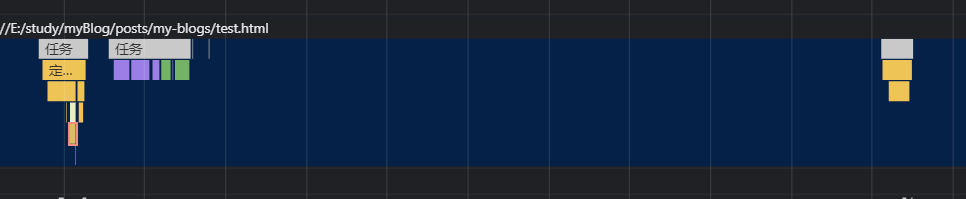

# 浏览器概念介绍

## 内核

通常指渲染内核，也就是渲染引擎，

常见的内核一般是 4 种：Trident、Gecko、Blink、Webkit

- Trident 是 IE 的内核
- Gecko：firefox 内核，也称作 firefox 内核
- Blink：是现在 chrome、opera 使用的内核
- webkit：以前的 chrome 使用的内核，是 safari 使用的内核

浏览器使用的内核：

- chrome：以前是 webkit，chrome 把 webkit 优化了俗称为 chromium 的内核；现在是 Blink，是 webkit 的分支，当然也可以叫做 chromium（所以现在**chrome 浏览器使用 blink 内核，V8JS 引擎**。）
- firefox：Gecko
- safari：webkit
- IE：Trident
- opera：最初是自己的 Presto 内核，后来是 Webkit，现在是 Blink 内核
- 国内一众浏览器大多是 IE+chromium 混杂的

## js 引擎

以前把 js 引擎和渲染内核合成为内核，现在基本上分开了。
js 引擎是运行、编译 js 的引擎，常见的就是 chrome 的 v8


- `Chrome`：V8
- `Firefox`：SpiderMonkey（1.0-3.0）/TraceMonkey（3.5-3.6）/JaegerMonkey（4.0-）
- `Safari`：Nitro
- `Opera`：Linear A/Linear B/Futhark/Carakan
- `IE` -> `Edge`：JScript/Chakra

# 浏览器是怎么工作的

以下只是简述过程，其中详细的算法可在下面文章了解
https://www.html5rocks.com/zh/tutorials/internals/howbrowserswork/#The_browsers_we_will_talk_about
**接下来的全部“浏览器”都是指 chrome**

## 基本概念

### 线程和进程

- 进程（Process）是操作系统进行资源分配的基本单元，进程可以申请内存空间、占用计算机资源、进行计算等等，是程序的基本实行实体；浏览器中有多个进程，每个进程负责一定的功能，比如 gpu 进程、渲染器进程、网络进程、浏览器进程等。**浏览器有多种进程分配方式，Chrome 默认会为每个标签页创建一个渲染器进程**
- 线程（Thread）是进行运算调度的最小单位（**线程才是最小、最基础的调度单位，进程是资源分配的基本单位**），一个进程可以拥有多个线程，每条线程执行不同的任务；在浏览器的主进程中就会有很多线程，比如主线程用于执行 js 和重绘重排，合成器线程用于拆分 `layout tree`和收发合成器帧等等


---

线程和进程的关系：

1. 进程中的任意一线程执行出错，都会导致整个进程的崩溃。
2. 线程之间共享进程中的数据。
3. 当一个进程关闭之后，操作系统会回收线程所占用的内存。
4. 进程之间的内容相互隔离，通信需要依靠专门的手段（比如 IPC）。

### 重绘重排

#### 重排（Reflow）（回流）

如果通过 JavaScript 或者 CSS 修改元素的几何**位置**属性，例如改变元素的宽度、高度，添加 margin、padding 等，那么浏览器会触发重新布局，解析之后的一系列子阶段，这个过程就叫重排。
重排会从解析 Style 开始，把后面的所有步骤都会再执行一次；重排需要更新完整的渲染流水线，所以开销也是最大的。

具体到操作，以下操作会导致重排：

1. 改变窗口大小
2. 改变文字大小
3. 内容的改变，如用户在输入框中敲字
4. 激活伪类，如`:hover `
5. 操作 class 属性
6. 脚本操作 DOM
7. **计算`offsetWidth`和`offsetHeight`，或者元素的`scrollTop`、`scrollLeft`等属性**，注意这里只要是打印、引用等就算是计算
8. 设置 style 属性


#### 重绘（Repaint）

重绘即改变颜色等操作，其不改变元素的图层、布局等，只是改变元素本身的样式，就会触发重绘。
重绘不会执行`Layout`和`Layer`阶段，直接执行 paint 及之后的操作，因此效率会高一些


#### 直接合成

如果更改一个既不需要布局也不需要绘制的属性，将会跳过布局和绘制阶段（即跳过重绘重排阶段），只执行后序的非主线程（合成线程和 gpu 进程）中的合成操作。


例子就是使用 transform 实现的 css 动画，会跳过重绘重排阶段，直接由 GPU 合成动画，不会和主线程发生冲突，因此可以大大提升效率。

### 浏览器架构演变

- 单进程架构：早期 web 浏览器架构，浏览器所有模块运行在同一个进程里，包括网络，插件，JavaScript 运行环境，渲染引擎等。这种架构所有模块运行在同一进程里，访问同一块内存区域，数据没有隔离，新增模块可能会影响原有功能，并且非常卡顿
- 多进程架构：现代浏览器架构，网络进程、渲染进程、插件进程、GPU 进程各司其职。这种架构各进程分配独立的内存区域，有些进程功能较大，耦合度高，进程间相互隔离，相对更加稳定和流畅
- 面向服务架构：将原来的 UI、数据库、文件、设备、网络等作为一个独立的服务。这种架构相比于多进程来说，服务模块划分更细，更内聚、耦合性低，易于扩展


### 浏览器中的主要进程


1. **浏览器（主）进程**：控制应用中的 “Chrome” 部分，包括地址栏，书签，回退与前进按钮。以及处理 web 浏览器不可见的特权部分，如网络请求与文件访问，**一般只有一个**，一个主进程会控制其他进程
2. **渲染进程**：控制标签页内网站展示，每创建一个标签页就会新创建一个渲染进行，包含浏览器内核；内部是多线程的；页面渲染、js 执行、事件循环等都在这里
3. **插件进程**：控制站点使用的任意插件，如 Flash。
4. **GPU 进程**：处理独立于其它进程的 GPU 任务。GPU 被分成不同进程，因为 GPU 处理来自多个不同应用的请求并绘制在相同表面。
5. **网络进程**：主要负责页面的网络资源加载，之前是作为一个模块运行在浏览器进程里面的，直至最近才独立出来，成为一个单独的进程。
6. **其他进程**：一些特殊的程序，比如 service worker、storage 等

因此 chrome 每打开一个页面，就会至少增加 4 个进程

### 浏览器中的主要线程


可以看到主要线程都是位于渲染进程下的，因为 html、css、js 的解析、js 的执行以及绘制等工作都在渲染进程，是我们能操作的、离我们最近的线程。

1. **GUI 渲染线程**

- 负责渲染浏览器界面，解析 HTML，CSS，构建 DOM 树和 RenderObject 树，布局和绘制等。
- GUI 渲染线程与 JS 引擎线程是互斥的

2. **JS 引擎线程**

- 也称为 JS 内核，负责处理 Javascript 脚本程序。（例如 V8 引擎）
- JS 引擎线程负责解析 Javascript 脚本，运行代码。
- JS 引擎一直等待着任务队列中任务的到来，然后加以处理，一个 Tab 页（renderer 进程）中无论什么时候都只有一个 JS 线程在运行 JS 程序

3. **事件触发线程**

- 归属于浏览器而不是 JS 引擎，用来控制事件循环
- 当 JS 引擎执行代码块如 `setTimeOut` 时（也可来自浏览器内核的其他线程,如鼠标点击、AJAX 异步请求等），会将对应任务添加到事件线程中
- 当对应的事件符合触发条件被触发时，该线程会把事件添加到待处理队列的队尾，等待 JS 引擎的处理
- 注意，由于 JS 的单线程关系，所以这些待处理队列中的事件都得排队等待 JS 引擎处理（当 JS 调用栈空闲时才会去执行）

4. **定时器线程**

用于计算定时器时间,并在时间到后把任务加入到事件队列中

5. **异步线程**

xhr/fetch 等网络请求的异步线程；当检测到状态变更，会根据回调或 Promise 将时间放回到任务队列中。

## 渲染过程工作原理


接下来会按照一定顺序解释浏览器是怎么把服务器上的资源解析成我们能看到的网页的

### 1. 用户输入

当用户在地址栏中输入一个查询关键字时，地址栏会判断输入的关键字是搜索内容，还是请求的 URL。
这个过程是在浏览器的主进程上进行的，因为涉及到浏览器本身的交互

### 2. 网络请求

1. 浏览器进程会通过进程间通信（IPC）把 URL 请求发送至网络进程，网络进程接收到 URL 请求后，会在这里发起真正的 URL 请求流程

2. 网络进程会查找本地的浏览器缓存中是否缓存了该资源。如果有缓存资源，那么直接返回资源给浏览器进程；没有则进入 DNS 解析步骤。

3. 进行网络连接步骤，详见网络那一块的。最终会建立 TCP 连接，然后发起 HTTP GET 请求获取资源；

在这个过程中，如果请求到的响应数据含有重定向信息，则浏览器还会执行重定向操作。这个操作是由浏览器主进程执行的

4. 响应头中，如果`Content-Type`字段的值被浏览器判断为下载类型，那么该请求会被提交给浏览器的下载管理器，同时该 URL 请求的导航流程就此结束。但如果是 HTML，那么浏览器就会准备进入渲染。

### 3. 渲染

Chrome 的默认策略是，每个标签对应一个渲染进程。
但如果从一个页面打开了另一个新页面，并且**新页面和当前页面属于同一站点**的话，那么新页面会复用父页面的渲染进程。官方把这个默认策略叫`process-per-site-instance`。

> 同一站点，指的是几个根域名和协议相同，子域名和端口不同的 url。
>
> 比如这几个 url 的协议都是 https，根域名都相同，但是子域名和端口略有差别，仍属于同一站点
>
> ```
> https://time.geekbang.org
> https://www.geekbang.org
> https://www.geekbang.org:8080
> ```

创建了渲染进程之后，浏览器就开始准备进行解析、绘制、渲染等工作；这个过程很复杂，因此又会分成许多子阶段

#### 3.0 提交文档

渲染进程准备好之后，还不能立即进入文档解析状态，因为此时的文档数据还在网络进程中，并没有提交给渲染进程，所以下一步就进入了提交文档阶段

这里的“文档”是指 URL 请求的响应体数据。

- “提交文档”的消息是由**浏览器进程**发出的，渲染进程接收到“提交文档”的消息后，会**和网络进程建立传输数据的“管道”**。
- 等文档数据传输完成之后，渲染进程会返回“确认提交”的消息给浏览器进程。
- 浏览器进程在收到“确认提交”的消息后，会**更新浏览器界面状态**，包括了安全状态、地址栏的 URL、前进后退的历史状态，并更新 Web 页面。


#### 3.1 构建 DOM 树


网络进程接收到响应头之后，会根据响应头中的 content-type 字段来判断文件的类型，比如 content-type 的值是“text/html”，那么浏览器就会判断这是一个 HTML 类型的文件，然后为该请求选择或者创建一个渲染进程。代码从网络传输过来是字节流的形式（上一步提交的文档），需要通过一系列方法将其转化为具体的 dom，转化流程如下：

1. Conversion（转换）：浏览器从网络或磁盘读取 HTML 文件原始字节，根据指定的文件编码（如 UTF-8）将字节转换成字符。
1. Tokenizing（分词）：浏览器根据 HTML 规范将字符串转换为不同的标记（如 <html>, <body>）。
1. Lexing（语法分析）：上一步产生的标记将被转换为对象，这些对象包含了 HTML 语法的各种信息，如属性、属性值、文本等。
1. DOM construction（DOM 构造）：因为 HTML 标记定义了不同标签之间的关系，上一步产生的对象会链接在一个树状数据结构中，以标识父子、兄弟关系。


比如这样一段代码：

```html
<!DOCTYPE html>
<html>
  <head>
    <link herf="#" />
  </head>
  <body>
    <p>hello world</p>
    <script src="index.js"></script>
    <div>hello browser</div>
  </body>
</html>
```

会生成这样的 DOM 树：


> 解析过程中，如果遇到 js 脚本则会先解析 js，原因是如果 js 会更改 dom，前面的解析可能会没有意义。并且渲染引擎在遇到 JavaScript 脚本时，不管该脚本是否操纵了 CSSOM，都会先执行 CSS 文件下载，解析操作，再执行 JavaScript 脚本（原因和 DOM 一样，js 有可能操作 CSSOM）。
>
> 即 JavaScript 会阻塞 DOM 生成，而样式文件又会阻塞 JavaScript 的执行。
>
> 如果是通过 src 引入的 js，则会阻塞 dom 解析并开始请求 js 文件，直到请求完成并解析完毕后才会继续进行 dom 树的构建。
>
> 因此解析步骤为：`dom -> cssom -> js -> dom`
>
> 这个过程最复杂的情况，就是这样：
> 
> 其实也比较好理解，只要记住：
>
> 1. 首先解析 HTML 并构建 DOM，期间会在网络进程中请求 css 并开始预解析，**但是并不会终止 DOM 的解析**；当 CSS 请求完毕后，再进行 CSS 解析，构建 CSSOM
> 2. 一旦在解析 HTML 期间遇到 js，就会终止 HTML 的解析，开始对 CSS 和 js 解析，且 CSS 的解析在 js 之前；这两个执行完成之后才会继续解析 DOM
> 3. 如果 js 是外部资源，就会同时开始 js 和 css 的请求，然后先解析 css、再解析 js
>
> 过程中的资源文件（样式表、img 等）也会在这个过程获取，每发现一个 src 的 url，就会再额外创建一个请求用以获取该资源，然后在 DOM 的构建中被插入到 DOM 树中；

#### 3.2 样式计算

上一步生成了 dom，接下来就是需要解析 css 获取 dom 的计算样式，以确定每个节点的样式信息

步骤如下：

1. 解析 css，即把 CSS 转换为浏览器能够理解的结构；和 HTML 一样，纯文本的 css 是不能被直接识别的，因此需要通过一系列转化把 css 也变成类似 dom 一样的结构（CSSOM，或者也叫`document.styleSheets`）。比如这样：


2. 转换样式表中的属性值，即计算、修改在 css 中的单位和一些非标准的数据（比如字符串的颜色会被统一为 rgb）

3. 结合 DOM 树，计算出 DOM 树的具体样式。这些样式的值可以通过 `window.getComputedStyle()` 获取

首先是通过一些 css 选择器，确定每个 dom 节点的样式；即使没有 css，浏览器内部也有自己的样式。
为了确定每个 dom 元素的样式，会使用到 css 的**继承**和**层叠**；

另外，这个过程中会像创建 dom 树一样创建 CSSOM，cssom 会和 dom 结合，根据选择器、层叠等各项与 dom 每个元素结合起来，形成一种一对一的关系；这样每个 dom 元素都有了自己的样式（注意这个样式不包括布局）

> CSSOM 的特点如下:
>
> - CSSOM 阻止任何东西渲染, 也就是说在 CSSOM 完全建立之前是不会展示界面的
> - CSSOM 在加载一个新页面时必须重新构建. 即使你的 CSS 文件被缓存了，也并不意味着这个已经构建好了的 CSSOM 可以应用到每一个页面。
> - CSSOM 是展示任何东西的必需品。在 CSSOM 构建之前，所有东西都不会展示，如果你阻塞了 CSSOM 的构建，CSSOM 的构建就会消耗更长的时间，这就意味着页面的渲染也需要更长的时间。

### 4. 布局阶段

现在，我们有 DOM 树和 DOM 树中元素的样式，但这还不足以显示页面，因为我们还不知道 DOM 元素的**几何位置信息**。那么接下来就需要计算出 DOM 树中可见元素的几何位置，我们把这个计算过程叫做布局。

Chrome 在布局阶段需要完成两个任务：创建布局树和布局计算

#### 4.1 创建布局树

主线程会通过像建立 dom 树一样的方式建立**Layout Tree**，每个节点上都记录元素的 xy 坐标、尺寸、边框等信息。layout 树是和展示在屏幕上的元素对应。布局树只会包含会显示在页面的元素，像 html 标签、设置了隐藏的元素都不会被放入布局树。


#### 4.2 布局计算

上一步计算了可见的节点及其样式，接下来需要计算它们在设备视口内的确切位置和大小，这个过程一般被称为自动重排。

浏览器的布局计算工作包含以下内容：

1. 根据 CSS 盒模型及视觉格式化模型，计算每个元素的各种生成盒的大小和位置。
1. 计算块级元素、行内元素、浮动元素、各种定位元素的大小和位置。
1. 计算文字，滚动区域的大小和位置。

#### 4.3 分割图层（渲染层）

计算布局之后的布局树并不能直接绘制出页面，因为页面中有很多单图层不能实现的效果，比如 z-index、transformZ 等。这时就需要浏览器为这些操作单独创建一个图层，并生成一颗对应的图层树，用于区分不同图层之间的关系。

浏览器的页面实际上被分成了很多图层，这些图层叠加后合成了最终的页面。层和布局树节点之间的关系如图所示：


不是布局树的每个节点都包含一个图层，如果一个节点没有对应的层，那么这个节点就从属于父节点的图层；
以下情况会为元素单独创建一个图层：

- 根元素 document
- **拥有层叠上下文属性的元素**，包括：
  - 设置了 z-index 的元素
  - 设置了透明度 opacity<1 的元素
  - 设置了明确的定位的元素，不一定是绝对定位，relative、sticky 等属性也可以
  - 有 css 滤镜（如 filter、mask 等）的元素
  - 设置了 translateZ 的元素
- 出现剪裁的地方。比如一个元素内部的文本超出了元素的大小，这时候就产生了剪裁，渲染引擎会把裁剪文字内容的一部分用于显示在 div 区域，像这样：
  
  因此，一旦出现这种剪裁，比如滚动条、或者显示不全的情况，就会为内部元素单独创建一个层。具体到 css 上，设置了 overflow 并且生效的元素就会产生额外图层。

图层稍后会被整理，并由 GPU 形成渲染纹理

#### 4.4 图层绘制

渲染引擎实现图层的绘制会把一个图层的绘制拆分成很多小的绘制指令，然后再把这些指令按照顺序组成一个待绘制列表，依次执行这些指令以绘制出一个完整的图层。
列表中的单个指令本身比较简单，因此即使是一个元素的绘制都需要很多条指令；所以在图层绘制阶段，输出的内容就是这些待绘制列表：


#### 4.5 栅格化

绘制列表只是用来记录绘制顺序和绘制指令的列表，而实际上绘制操作是由渲染引擎中的合成线程来完成的。当图层的绘制列表准备好之后，主线程会把该绘制列表提交（commit）给合成线程


在有些情况下，有的图层可以很大，比如有的页面你使用滚动条要滚动好久才能滚动到底部，但是通过视口（viewport），用户只能看到页面的很小一部分，所以在这种情况下，要绘制出所有图层内容的话，就会产生太大的开销，而且也没有必要。

基于这个原因，**合成线程**会将图层划分为**图块**（tile），图块的大小通常是`256x256`或者`512x512`；
划分完成后，合成线程会优先按照视口附近的图块生成位图，栅格化就是指将图块转化为位图

> 位图：亦称为点阵图像或栅格图像，是由称作像素的单个点组成的，即把图块变成真正的像素绘制效果。

位图大多数时候由 cpu 创建，即栅格化过程基本都由 cpu 完成。当位图生成完毕后，将存储在共享内存中，作为纹理上传到 GPU 中，最后由 GPU 将多个位图进行合成，然后 draw 到屏幕上完成最后的显示。因此栅格化的下一步就是位图的合成


### 5. 合成和显示（Composite）

一旦所有图块都被光栅化，接下来就会将栅格化后的图像（这时是一个一个的位图）合成（composite）为要显示在屏幕上的图像。

合成是由 GPU 来完成的，合成的内容包括一个个图块，以及上面拆分的不同图层；因此如果前面几步中形成了独立的图层，在合成过程中就会触发 gpu 的合成。最终合成完成后将交还给浏览器的渲染进程，完成最后的展示。

合成的优点是它在不涉及渲染主线程的情况下完成的。合成器不需要等待样式计算或 JavaScript 执行。只和合成相关的动画被认为是获得流畅性能的最佳选择。同时，合成器还负责处理页面的滚动，滚动的时候，合成器会更新页面的位置，并且更新页面的内容。当一个没有绑定任何事件的页面发生滚动时，合成器可以独立于渲染主线程之外进行合成帧的的创建，保证页面的流程滚动。

#### GPU 加速

GPU 加速的原理：浏览器的 GPU 加速功能是将需要进行加速的元素提升到一个独立的层（layer），这样就可以避免浏览器进行重新布局（Reflow）和绘制（Repaint），将原先的浏览器使用 CPU 绘制位图来实现的动画效果转为让 GPU 使用图层合成（composite）来实现，而合成本身也不占用主线程，就可以最大化加快速度。

**满足某些特殊条件的渲染层（PaintLayer，即由 css 产生的图层），会被浏览器自动提升为合成层**。合成层不等同于在 layer 步骤中创建的图层，而是一部分符合条件的图层提升得来。合成层是一个独立的层，而其他不是合成层的渲染层，则和其第一个拥有图形层的父层共用一个

合成层的创建条件（同时也是 GPU 的加速开启方式）如下：

- 3D transforms：`translate3d`、`translateZ` ；其中 transform2D 也可以达到加速的效果（跳过重绘重排），但并不等同于开启了 GPU 加速
- video、canvas、iframe 等元素
- 通过 `Element.animate()` 实现的 `opacity` 动画转换
- 通过 `СSS` 动画实现的 `opacity` 动画转换
- `position: fixed`
- 具有 `will-change` 属性
- 对 `opacity`、`transform`、`fliter` 应用了 `animation` 或者 `transition`；

提升为合成层的好处主要有以下几点：

- 合成层的位图，会交由 GPU 合成，比 CPU 处理要快
- 当需要 repaint 时，只需要 repaint 本身，不会影响到其他的层
- 对于 transform 和 opacity 效果，不会触发 layout 和 paint

> 3D 和 2D transform 的区别就在于，浏览器在页面渲染前为 3D 动画创建独立的复合图层，而在运行期间为 2D 动画创建。动画开始时，生成新的复合图层并加载为 GPU 的纹理用于初始化 repaint。然后由 GPU 的复合器操纵整个动画的执行。最后当动画结束时，再次执行 repaint 操作删除复合图层，所以 transform2D 动画期间由 GPU 全程控制，不会触发重绘重排

---

具体的 GPU 加速的常用方法：

- `transform`：可以通过三维的变化提前开启新图层（比如`translate3d`），这样会提前开启一个新图层
- `opacity`：
- `filter`：
- `will-change`：提前告诉浏览器在一开始就把元素放到新的图层，方便后面用 gpu 渲染的时候，不需要做图层的新建。

> 详见 https://juejin.cn/post/6844903966573068301

---

打开浏览器的图层调试面板，可以很清晰看到合成层的产生。

> 需要注意的是，这个调试面板展示的实际上应该是合成层，而不是在 Layer 步骤中创建的图层。

假如我们设置一个简单的 css 动画；当尝试用改变 left、top 等位置属性制作动画时，可以发现浏览器并没有单独给这个动画元素创建层，而是在唯一的 document 层上反复重绘，导致重绘次数非常高：


> document，即文档根元素也会单独形成一个合成层。这个层独立于 gui 渲染线程、合成线程渲染。因此即使渲染的主线程卡死（比如 js 中设置一个死循环），页面的滚动条依然可以滚动。其原因就是页面的滚动条是一个单独的合成层，由 gpu 控制渲染，并不会受到主线程的影响。

但是如果我们使用 transform 实现，就会单独为这个元素创建一个层，document 和这个元素都会只绘制一次：


可以看到合成原因是 transform 产生的动画。

如果我们使用上面说到的开启 gpu 的方法，也可以看到这里的合成原因（will-change 属性、3Dtransform、2Dtransform 动画）：


这里我们就可以视作浏览器为这个元素单独创建了合成层，实现了 gpu 加速。

另外，假如我们不设置动画，而只是设置 translate2D 用于改变位置，可以发现浏览器并没有创建合成层：


因此仅仅通过 transform2D（不包含动画）并不能开启 GPU 加速。

### 全流程


1. 渲染进程将 HTML 内容转换为能够读懂的 DOM 树结构。
1. 渲染引擎将 CSS 样式表转化为浏览器可以理解的 styleSheets，构建出 CSSOM 和 DOM 结合，计算出 DOM 节点的样式。
1. 创建布局树，并计算元素的布局信息。
1. 对布局树进行分层，并生成分层树。
1. 为每个图层生成绘制列表，并将其提交到合成线程。
1. 合成线程将图层分成图块，并在光栅化线程池中将图块转换成位图。
1. gpu 执行合成操作，最终渲染在屏幕上

### 优化

#### 针对 JavaScript

JavaScript 既会阻塞 HTML 的解析，也会阻塞 CSS 的解析。因此我们可以对 JavaScript 的加载方式进行改变，来进行优化：

1. 尽量将 JavaScript 文件放在 body 的最后
2. body 中间尽量不要写`<script>`标签
3. `<script>`标签的引入资源方式有三种，有一种就是我们常用的直接引入，还有两种就是使用 async 属性和 defer 属性来异步引入，两者都是去异步加载外部的 JS 文件，不会阻塞 DOM 的解析（尽量使用异步加载）。三者的区别如下：

- `script` 立即停止页面渲染去加载资源文件，当资源加载完毕后立即执行 js 代码，js 代码执行完毕后继续渲染页面；
- `async` 是在下载完成之后，立即异步加载，加载好后立即执行，多个带 async 属性的标签，不能保证加载的顺序；
- `defer` 是在下载完成之后，立即异步加载。加载好后，如果 DOM 树还没构建好，则先等 DOM 树解析好再执行；如果 DOM 树已经准备好，则立即执行。多个带 defer 属性的标签，按照顺序执行。

4. 防止内存泄漏：

- 全局变量、使用严格模式
- 未清理的 Dom 引用，手动删除 xxx.element = null
- 忘记清除定时器

5. 尽快跳出循环：使用 break ，或者 return
6. 合理使用闭包：使用闭包可以减少元素创建次数
7. 减少 Dom 访问：

- className 、 cssText 代替 style
- Dom 变量缓存
- getBoundingClientRect
- getComputedStyle

8. 防抖：防止多次提交按钮，只执行最后提交的一次，节流：保证在规定的时间内调用一次事件处理函数

- 进行窗口的 resize、scroll 事件时: 只计算最后一次结果进行执行
- DOM 元素的拖拽功能实现: 一个时间周期去获取一次位置并计算，防止超高频次触发位置变动

9. Web Worker ，文本复制传输 ，ArrayBuffer 直接传输

- 图片、等文件处理
- 加密算法
- 预先读取网络数据 ，缓存本地

#### 针对 CSS

使用 CSS 有三种方式：使用 link、@import、内联样式，其中`link`和`@import`都是导入外部样式。它们之间的区别：

- `link`：浏览器会派发一个新线程(HTTP 线程)去加载资源文件，与此同时 GUI 渲染线程会继续向下渲染代码（构建 DOM），如果已经完成构建，就会等待 css 脚本的下载；如果期间还有 js 脚本，两者会并行下载，最终都下载完成才继续渲染。
- `@import`：GUI 渲染线程会**暂时停止渲染**，去服务器加载资源文件，资源文件没有返回之前不会继续渲染(阻碍浏览器渲染)；
- `style`：GUI 直接渲染

外部样式如果长时间没有加载完毕，浏览器为了用户体验，会使用浏览器会默认样式，确保首次渲染的速度。所以 CSS 一般写在`<head>`中，让浏览器尽快发送请求去获取 css 样式。
所以，在开发过程中，导入外部样式使用 link，而不用`@import`。如果 css 少，尽可能采用内嵌样式，直接写在 style 标签中。

> 关于`@import`和`<link>`加载 css 的方式，网上基本上都在说`@import引用的CSS会等到页面全部被下载完再被加载`。
> 但是经过实测，以浏览器网络监听的加载顺序为例，这两者的加载顺序是按照从上到下正序排列的；也就是说如果包含`@import`的 style 标签在 link 之前，他也会在 link 之前加载，并不是所说的一定在页面加载完之后才加载

#### 针对 DOM、CSSOM

可以通过以下几种方式来减少渲染的时间：

- HTML 文件的代码层级尽量不要太深
- 使用语义化的标签，来避免不标准语义化的特殊处理
- 减少 CSSOM 代码的选择器层级，因为选择器是从左向右进行解析的；直接用类选择器是最高效的

#### 减少回流与重绘

- 操作 DOM 时，尽量在低层级的 DOM 节点进行操作
- 不要使用 table 布局， 一个小的改动可能会使整个 table 进行重新布局
- 使用能避开重绘重排的属性，比如 transform 等。对于动画或渲染负担重的元素，可以开启 GPU 加速
- 不要频繁操作元素的样式，对于静态页面，可以修改类名，而不是样式。
- 将 DOM 的多个读操作（或者写操作）放在一起，而不是读写操作穿插着写。这得益于浏览器的渲染队列机制。

> 浏览器针对页面的回流与重绘，进行了自身的优化，即渲染队列
> 浏览器会将所有的回流、重绘的操作放在一个队列中，当队列中的操作到了一定的数量或者到了一定的时间间隔，浏览器就会对队列进行批处理。这样就会让多次的回流、重绘变成一次回流重绘。
> 将多个读操作（或者写操作）放在一起，就会等所有的读操作进入队列之后执行，这样，原本应该是触发多次回流，变成了只触发一次回流

## 浏览器一帧内都做了什么

对于从输入 URL 到看到界面这个过程，包括 DNS 解析、缓存、渲染，而渲染过程又包括 DOM 和 CSS 解析、布局树的计算、分层、绘制、分块、光栅化、合成。
当首屏界面渲染完后，在应用的运行过程中，还会继续渲染，那么这个渲染过程就是指在初始化渲染之后，后续的“每帧”的工作。

首先要明确一点，浏览器会定时刷新界面，不管 js 有没有改变 dom。通常刷新频率和显示器帧率相同，大部分显示器帧率是 60fps，≈16ms 每帧。
由于定时刷新，因此会产生不同的帧。浏览器把渲染任务会放到每一帧内执行。但是并不是每一帧都会去执行渲染，如果没有修改 dom 或导致页面改变的操作，那就不会执行渲染。
在定时刷新帧的间隔，还会有其他的任务。比如用户可能会触发一些元素事件（输入文本点击按钮等），还可能有定时任务或者异步任务执行，这些任务的执行是会阻塞渲染的。


浏览器在一帧内可能会做执行下列任务，而且它们的执行顺序基本是固定的:

- 处理用户输入事件，这里不是指执行 js 回调，而是浏览器通过事件处理线程来捕获用户的事件，比如点击、鼠标移动等，但不包括 resize 和 scroll 这两个特殊的事件
- Javascript 执行，这里的 js 执行的内容可能有几种情况：
  - 事件处理的回调，即上一步处理输入事件的 js 回调
  - 定时器。如果定时器到期，那么就会执行一个宏任务，当定时器回调内部修改了 dom 时，就会在后面执行重绘重排的逻辑
  - 宏任务和微任务：如果在这段 js 执行期间派发微任务，那么会立即在渲染前执行。如果派发了宏任务，那么会在渲染之后才执行。
    参考下面这张图，中间紫色部分是渲染，前面的黄色表示由 setInterval 引起的一个帧调用内部的逻辑，执行了 queueMicrotask 创建的微任务；后面的黄色部分则是 setTimeout 的回调：
    
    代码：
    ```js
    setInterval(() => {
      console.log(1);
      queueMicrotask(() => console.log("mic"));
      setTimeout(() => console.log("mac"));
      document.body.appendChild(document.createElement("p"));
    }, 500);
    ```
- begin frame，这一步会在渲染前执行一些任务，包括 resize、scroll 回调的执行。这两个事件较为特殊，因为他们是由 gpu 线程直接控制的，比如滚动不会因为 js 线程阻塞就不能滚动了。
- rAF 调用
- 布局 Layout
- 绘制 Paint
- 宏任务执行，这里的宏任务是在之前 js 代码执行中派发的宏任务。如果是定时器、异步回调这类，可能会在之后的某个时间段执行
- requestIdleCallback 回调：当上述工作都完成时，task 队列和 microTask 队列都为空，并且本帧内还有时间，就会执行这个回调。

### requestIdleCallback

requestIdleCallback 是浏览器提供给我们的空闲调度算法，意图是让我们把一些计算量较大但是又没那么紧急的任务放到空闲时间去执行。不要去影响浏览器中优先级较高的任务，比如动画绘制、用户输入等等。

ric 的调用有两个参数：

```js
requestIdleCallback(
  (IdleDeadline) => {
    console.log(IdleDeadline.didTimeout, IdleDeadline.timeRemaining());
  },
  { timeout: 2000 }
);
```

requestIdleCallback 的第二个参数，即包含 timeout 属性的一个对象，表示这个 ric 必须要在超时时间内执行。因为如果浏览器一直没有空闲时间，ric 就会有一直不能执行的可能。timeout 属性就要求至少要在一定时间内执行这个 ric，浏览器会放弃一些绘制渲染等任务来执行这个 ric 的回调。

IdleDeadline 对象的两个属性分别表示：

- didTimeout：如果这个 ric 是通过 timeout 调用的，这个值就为 true
- timeRemaining：获取当前帧内还剩多少空余时间

ric 的调用时机一般如下图所示：


有一类特殊情况，就是当浏览器有较长时间的空闲时，ric 的可执行时间就会变长，但最多不会超过 50ms，防止造成用户输入的不及时响应。


# v8 引擎

## 解释型和编译型

- 编译型语言在程序执行之前，需要经过编译器的编译过程，并且编译之后会直接保留机器能读懂的二进制文件（即可执行文件），这样每次运行程序时，都可以直接运行该二进制文件，而不需要再次重新编译了。比如 C/C++、GO 等都是编译型语言。

- 解释型语言编写的程序，在每次运行时都需要通过解释器对程序进行动态解释和执行。比如 Python、JavaScript 等都属于解释型语言。


## V8 是如何执行一段 JavaScript 代码的


详细流程见：https://blog.poetries.top/browser-working-principle/guide/part3/lesson14.html#%E7%BC%96%E8%AF%91%E5%99%A8%E5%92%8C%E8%A7%A3%E9%87%8A%E5%99%A8

## 关键概念

下面的一些关键概念都**不是很深入**, 毕竟这些东西要是深入讲怕是得再写几篇博客了....

### 词法分析（分词器 tokenizer）和语法分析（解析器 parser）

源代码会先进行分为词法分析和语法分析的两个步骤，把源代码转为 AST；
同时这一步也是创建 js 执行上下文，并压入栈的过程

- 词法分析: 使用一个一个读字符并和 js 关键字比对的方式确定一个个 token,比如这一句:
  ```js
  let x = 1;
  ```
  - let 是关键字
  - x 是标识符
  - =是赋值
  - 1 是数字变量

分词器 tokenizer 会按照字符串的顺序逐个解析字符，并按照解析的顺序将其拆分成一个个的对象，供给下一步的解析器生成具体的 ast
词法分析之后的结果大概是这样（只是示例）：

```js
[
  { type: "keywords", value: "let" },
  { type: "variables", value: "x" },
  { type: "paren", value: "=" },
  { type: "number", value: "2" },
];
```

- 语法分析: 就是按照抽象语法树的分析方法生成语法树。这一步会递归解析上一步的分词结果，创建对应的 ast 对象。比如整段代码会创建一个 Program 对象，变量声明语句会创建 VariableDeclaration 对象，数字、字符串会创建对应的字面量对象等等。然后把他们递归地结合起来，生成一棵完整的 AST。

### 抽象语法树

接下来用一个函数举例子, 抽象语法树是怎么生成的

```js
const fn = (a) => a;
```


### 字节码

**字节码是机器代码的抽象**
下面同样是个函数的例子, 来解释字节码长什么样

```js
function incrementX(obj) {
  return 1 + obj.x;
}

incrementX({ x: 42 }); // V8 的编译器是惰性的，如果一个函数没有运行，V8 将不会解释它
```

下面是字节码:

```
[generating bytecode for function: incrementX]
Parameter count 2
Frame size 8
  12 E> 0x2ddf8802cf6e @    StackCheck
  19 S> 0x2ddf8802cf6f @    LdaSmi [1]
        0x2ddf8802cf71 @    Star r0
  34 E> 0x2ddf8802cf73 @    LdaNamedProperty a0, [0], [4]
  28 E> 0x2ddf8802cf77 @    Add r0, [6]
  36 S> 0x2ddf8802cf7a @    Return
Constant pool (size = 1)
0x2ddf8802cf21: [FixedArray] in OldSpace
 - map = 0x2ddfb2d02309 <Map(HOLEY_ELEMENTS)>
 - length: 1
           0: 0x2ddf8db91611 <String[1]: x>
Handler Table (size = 16)
```

大概解释一下:

- 首先只需要关注@符后面的代码
- `LdaSmi [1]` 将常量 1 加载到累加器中。
- 接下来，`Star r0` 将当前在累加器中的值 1 存储在寄存器 r0 中。
- `LdaNamedProperty a0`表示把 0 的命名属性(NamedProperty)添加到累加器中. 查找属性通过下面的 map 和 length, 这里表示 0 是 obj 的 x 属性,也就是添加了`obj.x`;后面的[4]是为优化做准备的
- `Add r0, [6]`是相加, 最后的 Return 返回

V8 引擎是一个 JavaScript 引擎实现，最初由一些语言方面专家设计，后被谷歌收购，随后谷歌对其进行了开源。V8 使用 C++开发.
v8 的大致执行流程为:
`源代码===解析器===>抽象语法树(AST)====解释器===>字节码(bytecode)====编译器===>机器代码`

1. 首先解析器将 js 代码变为抽象语法树, 这也是每个引擎都要做的
2. 解析器通过基准解释器(igniton)转化为字节码, 并且删除 AST 释放内存
3. 解释器直接执行字节码, 并在运行过程中不断收集优化信息. 注意解释器是不直接在一开始就编译成机器码的, 而是直接执行字节码
4. 优化信息发送给优化编译器(turboFan)编译出优化后的机器代码


### Ignition（解释器）

负责将经过词法分析和语法分析得出的 AST 转为**字节码**。

字节码就是介于 AST 和机器码之间的一种代码。但是与特定类型的机器码无关，字节码需要通过解释器将其转换为机器码后才能执行；机器码所占用的空间远远超过了字节码，所以使用字节码可以减少系统的内存使用。字节码出现的原因是移动端大量的机器码会占用极大的内存，借助字节码可以减少内存的占用。

字节码在稍后会被逐行解析为机器码，然后再执行。代码执行得越久，执行效率就会越快，因为会有越来越多的字节码被标记为热点代码，遇到他们就可以直接执行，而不用转成机器码。


### TurboFan (编译器)


在执行**字节码**的过程中，如果发现有热点代码（HotSpot），比如一段代码被重复执行多次，这种就称为热点代码，那么后台的编译器 TurboFan 就会把该段热点的字节码编译为高效的**机器码**，然后当再次执行这段被优化的代码时，只需要执行编译后的机器码就可以了，这样就大大提升了代码的执行效率。

> 注意：v8 不会直接把字节码变成机器码, 而是只会把一部分热点代码变成执行效率更高的机器码

### JIT(即时编译)

就是指解释器 `Ignition` 在解释执行字节码的同时，收集代码信息，当它发现某一部分代码变热了之后，`TurboFan `编译器便闪亮登场，把热点的字节码转换为机器码，并把转换后的机器码保存起来，以备下次使用。
这里的 `TurboFan` 就是 JIT 编译器。
