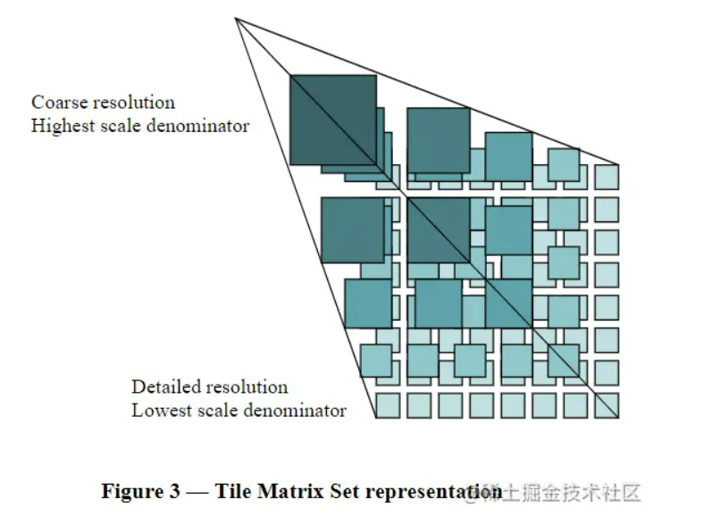
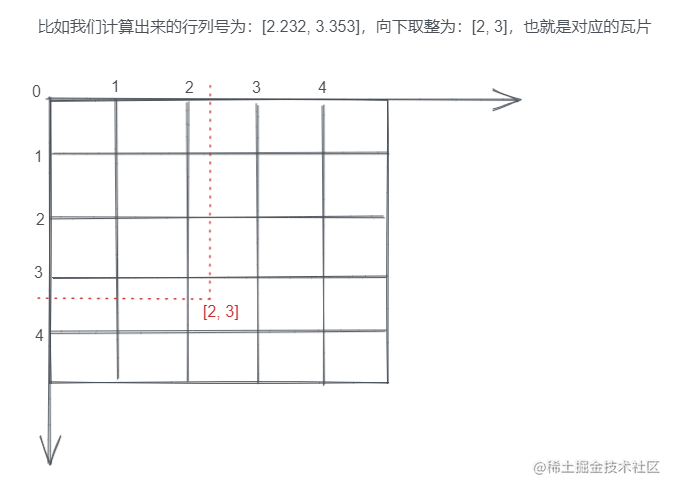
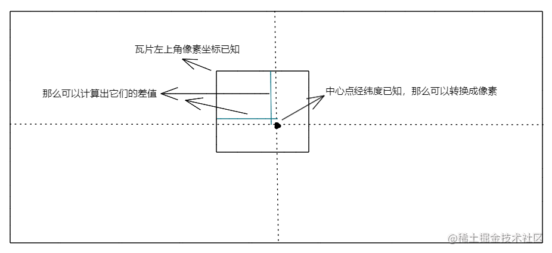

参考：https://juejin.cn/post/7054729902871805966

现代 web2D 地图的实现一般都是基于 canvas 的瓦片地图，比如网页端的高德地图就是这样。
这篇文章主要讲解如何自行实现一个 canvas 瓦片地图。

# 基本概念

## 瓦片

瓦片地图的基本原理，是把地球投影成一个巨大的正方形世界平面图，然后按照四叉树进行分层切割，比如第一层，只有一张瓦片，显示整个世界的信息，所以基本只能看到洲和海的名称和边界线，第二层，切割成四张瓦片，显示信息稍微多了一点，以此类推，就像一个金字塔一样，底层分辨率最高，显示的细节最多，瓦片数也最多，顶层分辨率最低，显示的信息很少，瓦片数量相对也最少：



也就是说，地图的区域其实是固定大小的，也就是 canvas 的大小；当我们放缩时，改变的实际上是这些区域内绘制的瓦片。比如原始大小绘制的是最大的四个瓦片，放大一倍之后，就绘制下一级的瓦片，下一级的瓦片从分辨率上大一倍，但在 canvas 的区域内仍是四个，相当于原始的一个瓦片细分为了四个小的。

## 地理坐标

绘制真实地图其实是一件比较麻烦的事情，因为要考虑到真实坐标的计算。
地图的坐标系、比例尺、投影方式都是比较麻烦的内容，这里不再做赘述，只需要知道可以通过具体的地理坐标找到这个坐标所在的那个位置的各级瓦片就行了。

瓦片的排布本质上是把地图划分成`n * m`份，我们取瓦片也是按照行和列去取的。所以这里需要一个转换

```
经纬度 -> 像素坐标 -> 瓦片行列号
```

像素坐标其实就是把地图通过投影成一个二维矩形，某一个点在这个矩形上的像素 x 和 y 值。一般地图是和 canvas 一样，以左上角为原点；

这里的计算可以参考 https://juejin.cn/post/7054729902871805966#heading-3 ，比较麻烦

# 实现原理

## 概述

瓦片地图的实现方式概述如下：

1. 随机选定一个经纬度，作为地图的初始中心点，也就是默认进入时的位置。这个中心点需要和 canvas 中心点重合，后续重新绘制都是依赖中心点的改变
2. 通过中心点的经纬度，可以计算出中心点位置的瓦片的位置信息（行、列、缩放层级），然后根据这三个关键信息去拼接 url，请求对应的瓦片。瓦片图片的来源一般高德、百度等地图都会提供
3. 得到瓦片之后，将其绘制到合适的位置上。因为我们得到的是中心点对应的那个瓦片，所以我们把这个瓦片绘制在中心。具体绘制方法下面详述
4. 中心瓦片绘制完之后，根据偏移量绘制四周瓦片直到铺满 canvas。比如中心瓦片的绘制坐标为`(x, y)`，那么它紧邻左边的一个就应该是`(x-tilesWidth, y)`，依次类推
5. 增加缩放逻辑：每次鼠标滚动或点击缩放其实都是改变了瓦片的层级。层级改变就意味着全部替换成新的瓦片图，比如之前是最大的，放大一倍后就变成 4\*4 的。保持中心坐标不变，更新层级，然后从第二步开始重新渲染即可
6. 增加拖拽逻辑：拖拽实现其实和缩放差不多，不过拖拽修改了中心位置，然后根据更新的中心位置再从第二步开始重新渲染。拖拽时不是所有瓦片都需要重新请求，需要一个缓存逻辑，拖拽过程中在可视区域内的瓦片只需要改变位置而不需要重新请求。
7. 增加部分过渡动画，这些就是锦上添花的，比如放缩时加上一个 transition 等等

下面是具体实现方式

## 具体实现

### 经纬度定位行列号

第一步要把经纬度坐标转换为 Web 墨卡托投影坐标。这个公式直接用就好了，涉及到地图的转换，其实是比较麻烦的数学问题

```js
// 角度转弧度
const angleToRad = (angle) => {
  return angle * (Math.PI / 180);
};

// 弧度转角度
const radToAngle = (rad) => {
  return rad * (180 / Math.PI);
};

// 地球半径
const EARTH_RAD = 6378137;

// 4326转3857
const lngLat2Mercator = (lng, lat) => {
  // 经度先转弧度，然后因为 弧度 = 弧长 / 半径 ，得到弧长为 弧长 = 弧度 * 半径
  let x = angleToRad(lng) * EARTH_RAD;
  // 纬度先转弧度
  let rad = angleToRad(lat);
  let sin = Math.sin(rad);
  let y = (EARTH_RAD / 2) * Math.log((1 + sin) / (1 - sin));
  return [x, y];
};

// 3857转4326
const mercatorTolnglat = (x, y) => {
  let lng = radToAngle(x) / EARTH_RAD;
  let lat = radToAngle(2 * Math.atan(Math.exp(y / EARTH_RAD)) - Math.PI / 2);
  return [lng, lat];
};
```

最后得到的是 3857 坐标，它的单位是米。
3857 坐标系把地球当做正圆球体来处理，所以可以算出地球周长，投影是贴着地球赤道的
投影成正方形的世界平面图后的边长代表的就是地球的周长，前面我们也知道了每一层级的瓦片数量的计算方式，而一张瓦片的大小一般是 256\*256 像素，所以用地球周长除以展开后的世界平面图的边长就知道了地图上每像素代表实际多少米

```js
// 地球周长
const EARTH_PERIMETER = 2 * Math.PI * EARTH_RAD;
// 瓦片像素
const TILE_SIZE = 256;

// 获取某一层级下的分辨率
const getResolution = (n) => {
  const tileNums = Math.pow(2, n);
  const tileTotalPx = tileNums * TILE_SIZE;
  return EARTH_PERIMETER / tileTotalPx;
};
```

把坐标除以分辨率就可以得到对应的像素坐标，再除以 256，就可以得到瓦片的行列号：



```js
const getTileRowAndCol = (x, y, z) => {
  let resolution = getResolution(z);
  let row = Math.floor(x / resolution / TILE_SIZE);
  let col = Math.floor(y / resolution / TILE_SIZE);
  return [row, col];
};
```

### 瓦片显示位置计算

这一步需要解决两个问题，一个是加载多少块瓦片，二是计算每一块瓦片的显示位置。

首先先选定一个中心坐标的经纬度，然后根据这个坐标计算出该坐标所在的瓦片的行列。缩放层级默认为 17 级 （相当于地图上分为`2^17`个瓦片）

```js
// 中心点对应的瓦片
let centerTile = getTileRowAndCol(
  ...lngLat2Mercator(...this.center), // 4326转3857
  this.zoom // 缩放层级
);
```

接下来的步骤是：

1. 先确定瓦片的左上角的像素坐标和中心点的像素坐标，然后计算他们的差值；原理如下图：



2. 把画布的原点移动到画布中间，也就是把中心经纬度作为坐标原点，那么中心瓦片的显示位置就是这个差值。

```js
// 中心点对应的像素坐标
let centerPos = getPxFromLngLat(...this.center, this.zoom);
// 中心瓦片左上角对应的像素坐标
let centerTilePos = [centerTile[0] * TILE_SIZE, centerTile[1] * TILE_SIZE];

// 中心像素坐标距中心瓦片左上角的差值
let offset = [centerPos[0] - centerTilePos[0], centerPos[1] - centerTilePos[1]];

// 移动画布原点到画布中间
this.ctx.translate(this.width / 2, this.height / 2);
// 加载瓦片图片
let img = new Image();
// 拼接瓦片地址
img.src = getTileUrl(...centerTile, this.zoom);
img.onload = () => {
  // 渲染到canvas
  this.ctx.drawImage(img, -offset[0], -offset[1]);
};
```

3. 根据中心瓦片的绘制位置，绘制其他瓦片

这一步其实分为两步，第一步是先计算要绘制多少。也就是通过 canvas 的宽高计算出边界的瓦片序号

```js
// 计算瓦片数量
let rowMinNum = Math.ceil((this.width / 2 - offset[0]) / TILE_SIZE); // 左
let colMinNum = Math.ceil((this.height / 2 - offset[1]) / TILE_SIZE); // 上
let rowMaxNum = Math.ceil(
  (this.width / 2 - (TILE_SIZE - offset[0])) / TILE_SIZE
); // 右
let colMaxNum = Math.ceil(
  (this.height / 2 - (TILE_SIZE - offset[1])) / TILE_SIZE
); // 下
```

然后绘制其他瓦片。绘制方法其实就是基于中心瓦片的 offset 做偏移控制：

```js
// 从上到下，从左到右，加载瓦片
for (let i = -rowMinNum; i <= rowMaxNum; i++) {
  for (let j = -colMinNum; j <= colMaxNum; j++) {
    // 加载瓦片图片
    let img = new Image();
    img.src = getTileUrl(
      centerTile[0] + i, // 行号
      centerTile[1] + j, // 列号
      this.zoom
    );
    img.onload = () => {
      // 渲染到canvas
      this.ctx.drawImage(
        img,
        i * TILE_SIZE - offset[0],
        j * TILE_SIZE - offset[1]
      );
    };
  }
}
```

实在要记住中心瓦片的绘制位置是 offset，其他瓦片都是根据这个来改变绘制位置。
如果拖拽或改变中心坐标，那么其实也会修改中心瓦片的绘制 offset，然后再依次修改其他瓦片的绘制即可。

### 拖动

把上两步合并为一个完整的 render 过程，实现的效果就是：

```
传入一个中心坐标经纬度 -> 计算得到中心坐标所在的瓦片 -> 将该瓦片绘制到中心 -> 绘制其他瓦片直到铺满canvas
```

因此拖动的实现其实就是从第一步开始，计算拖动的偏移量，然后修改中心坐标，再执行上述渲染过程重新绘制即可。

实现关键点：

1. 首先先计算拖动的偏移量映射到实际坐标系是多少：

```js
// 计算本次拖动的距离对应的经纬度数据
let mx = e.movementX * resolutions[this.zoom];
let my = e.movementY * resolutions[this.zoom];
// 把当前中心点经纬度转成3857坐标
let [x, y] = lngLat2Mercator(...this.center);
// 更新拖动后的中心点经纬度
center = mercatorToLngLat(x - mx, my + y);
```

2. 按照上述步骤重新计算和渲染

```js
// 清空画布
this.clear();
// 重新绘制，renderTiles方法就是上一节的代码逻辑封装
this.renderTiles();
```

3. 添加缓存。因为拖动过程不是全部加载新的瓦片，大部分瓦片只需要改变位置即可。如果不这样做。鼠标移动过程中，会不断的计算出要加载的瓦片进行加载，但是可能上一批瓦片还没加载完成，鼠标已经移动到新的位置了，又计算出一批新的瓦片进行加载，此时上一批瓦片可能加载完成并渲染出来了，但是这些瓦片有些可能已经被移除画布，不需要显示，有些可能还在画布内，但是使用的还是之前的位置，渲染出来也是不对的，同时新的一批瓦片可能也加载完成并渲染出来，自然导致了最终显示的错乱。

我们加个缓存对象，因为在拖动过程中，很多瓦片只是位置变了，不需要重新加载，同一个瓦片加载一次，后续只更新它的位置即可；另外再设置一个对象来记录当前画布上应该显示的瓦片，防止不应该出现的瓦片渲染出来

```js
{
    // 缓存瓦片
    tileCache: {},
    // 记录当前画布上需要的瓦片
    currentTileCache: {}
}
```

通过瓦片的行列信息生成瓦片的 id，每次渲染完瓦片之后，在 currentTileCache 存下这个瓦片 id，表示当前地图需要这个瓦片。然后判断当前瓦片是否在 cache 中：

- 如果在 cache 中，就更新位置，然后重新渲染
- 如果不在就创建新的瓦片，执行拼接 url、请求等步骤

```js
for (let i = -rowMinNum; i <= rowMaxNum; i++) {
  for (let j = -colMinNum; j <= colMaxNum; j++) {
    // 当前瓦片的行列号
    let row = centerTile[0] + i;
    let col = centerTile[1] + j;
    // 当前瓦片的显示位置
    let x = i * TILE_SIZE - offset[0];
    let y = j * TILE_SIZE - offset[1];
    // 缓存key
    let cacheKey = row + "_" + col + "_" + this.zoom;
    // 记录画布当前需要的瓦片
    this.currentTileCache[cacheKey] = true;
    // 该瓦片已加载过
    if (this.tileCache[cacheKey]) {
      // 更新到当前位置
      this.tileCache[cacheKey].updatePos(x, y).render();
    } else {
      // 未加载过
      // tile对象保存瓦片的位置、url、是否渲染等信息
      this.tileCache[cacheKey] = new Tile({
        ctx: this.ctx,
        row,
        col,
        zoom: this.zoom,
        x,
        y,
        // 判断瓦片是否在当前画布缓存对象上，是的话则代表需要渲染
        shouldRender: (key) => {
          return this.currentTileCache[key];
        },
      });
    }
  }
}
```

这里还有一个实现的小 bug，tileCache 内的瓦片对象只会增加不会减少，而只是通过 shouldRender 来判断渲染的时候是否要渲染自己。
当地图瓦片加载累计多时，有可能会有内存问题。因此进一步的话可以添加一个销毁逻辑。

### 缩放

缩放比拖拽实现简单，其实就是修改全局的 zoom，然后根据这个 zoom 重新渲染所有瓦片就可以了

```
修改zoom -> 瓦片重新请求 -> 绘制到具体位置
```

### 其他

还有一些其他的实现作为锦上添花：

- 缩放和拖动过程，渲染瓦片图片可以增加一个过渡。过渡其实本质就是动画，可以通过 Konva 来实现一个透明度从 1 渐变到 0 的动画，每次渲染一个瓦片之前先加载这个动画就行了
