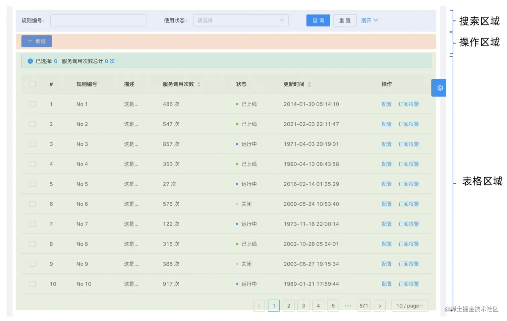
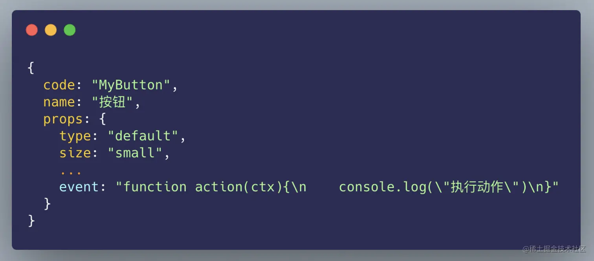
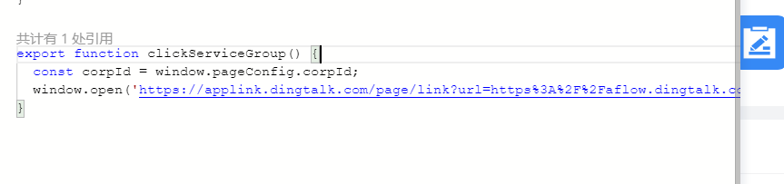
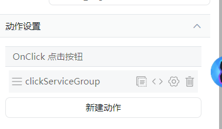
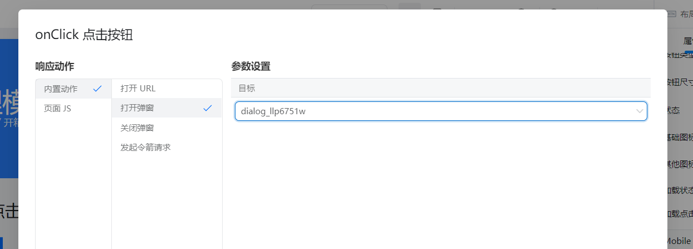

# 低代码概述

低代码（Low-Code Development，LCD），开发者主要通过图形化用户界面和配置来创建应用软件，而不是像传统模式那样主要依靠手写代码。低代码开发模式的开发者，通常不需要具备非常专业的编码技能，或者不需要某一专门领域的编码技能，而是可以通过平台的功能和约束来实现专业代码的产出。

我们在前端开发脚手架中，通常会创建一些通用的组件，然后在各个需要这个组件的地方进行引用，来提升开发效率。在脚手架中引用一些 ui 组件库也是出于这样的目的。后来，为了防止重复的造轮子，我们通常会对一些成熟的 ui 组件库中组件根据我们的业务需要进行二次封装，形成一个具有更多功能的区块，例如 B 端系统中最为常见的列表数据增删改查界面就是这样一个区块。



我们可以通过一个 json 数据来描述这个区块，包含了这个区块的编码，中文名称，以及可传入到这个区块中的属性及初始属性值，例如这个表格包含的列信息、按钮信息等等。而这个 json 也是低代码平台搭建中最为核心的部分。

在一些低代码平台的开发平台上，用于显示效果的“画布”其实本质上就是通过这个 json 渲染的。比如我们拖拽一个 button 组件进去，实际上就是增加了一个 json 项，然后画布组件根据它来进行渲染。

```json
{
  "code": "Table",
  "name": "表格",
  "props": {
    "columns": [
      {
        "name": "name",
        "desc": "姓名"
      },
      {
        "name": "age",
        "desc": "年龄"
      }
    ],
    "data": []
  }
}
```

再比如说，假如有一个 input 组件，它的元数据如下：

```json
{
  "code": "Input",
  "name": "文本框",
  "props": {
    "defaultText": ""
    // ...
  }
}
```

我们可以在配置区域给这个 input 组件提供一个配置项，即默认内容。当配置之后，实际就是修改这里的元数据，然后画布再根据元数据去渲染，就可以显示我们的配置内容了。
所以无论是组件的拖拽引入，还是属性的修改增加，其实都是在元数据的基础上进行修改，然后画布根据这些元数据进行列表渲染、dfs 渲染等。

---

如果开发完成，导出成为具体的项目，那么这个当通过项目的方式进入到这个页面时，我们只需要将之前存储到数据库的区块描述信息通过 api 接口获取到，再传递到组件内部，比如上面示例的 json 里的 data 属性可以被填入具体的值。最后把整个 props 交给组件处理，就可以实现正常的渲染了。

因此低代码平台的核心逻辑：**通过组件元数据拼装成一个页面的描述信息，然后通过渲染器组件将描述信息转化页面 dom 元素**。

# 实现原理

参考：
https://juejin.cn/column/7134627971897720840

详细内容主要参考这些参考内容，这里只是做一个简单概括

## 基本功能

低代码平台基本功能的概述和实现思路：

1. 元数据：以 json 为格式的元数据是画布绘制的核心，也是实际组件生成的核心。

一般来说一个组件的元数据可能有以下内容：

- 组件名，实际编码的组件名称，一般是一些预设好的，比如 Table、Input。这些组件都是一些现有的，渲染时直接引入这些组件传入 props；
- 描述、中文名，帮助组件在平台上的显示
- 唯一 id，主要用于区分不同组件，在事件调用中，一个组件在全局暴露出的方法就要通过唯一 id 来区分。比如多个 modal 暴露的关闭方法显然需要区分
- children?: 嵌套组件可能会用到，表示当前组件的子组件的元数据。在渲染时需要 dfs 元数据来渲染
- props：给组件的 props，这些内容可能是扁平的，也可能是嵌套的；当渲染组件时会传给具体的组件。props 还包括一些内容：
  - 组件专属的属性，比如 button 组件的 text 按钮文本、表格组件的 column 等。这些内容一般都是静态配置的，可以在平台的配置面板去做修改
  - event：作为组件的事件执行函数传入。可能是一个值，也可以是一个数组或对象。比如 button 可以绑定 onclick 事件的回调函数。这个值通常是一个字符串的形式，比如：
    
    在组件内部，可以通过`Function(funcStr)`来构造并执行这个回调。
  - data：一些数据展示组件，比如表格、列表，都需要从服务端获取数据。可以在平台上配置一个请求或者模拟数据，注入到组件的 data 属性内；或者给组件向外暴露一个接受请求的方法，执行这个方法就可以获取数据进行渲染。获取的数据可以被保存在一个全局状态或者 window 上，根据组件实际需求来获取。
  - action：配置组件的行为，比如按钮可以有点击的动作，那么点击触发的方法名称、参数等信息都可以配置在这里。action 在组件内部被处理，比如下面这个逻辑其实相当于当点击组件时，会调用全局的其他方法。
    action 和 event 其实并没有特别大差异，比如同样一个打开弹窗的动作，可以让用户手写 js，也可以通过配置方式实现。总之都是在组件内根据情况来执行；
    ```js
    {
        action: [
            {
                actionType: "onclick",
                actionName: "打开弹窗" ,
                actionFuncName: "Modal_modalidxx_onOpen",
                params: {...}
            }
        ]
    }
    ```

2. 平台拖拽功能和配置功能的实现

3. 组件事件的添加

事件可以分为三类型：

- 全局事件：不专属某个组件，而是全局生效的事件，比如路由的跳转、全局的消息提示
- api 调用：请求数据，和服务端交互
- 组件事件：每个组件主动暴露自己的方法，并监听对暴露方法的调用。

前两个事件我们可以直接在全局安插，组件内调用。比如我们全局添加一个路由跳转函数，有个 button 组件可以配置点击时触发该方法，相当于把这个方法通过 props 传入该组件，这样当点击时就会执行这个全局方法。




每个组件有自己的动作设置，比如按钮可以有点击的动作，input 可能有聚焦的动作等等。这些动作都可以被设置回调，这些回调可以是组件内部的，也可以是外部暴露的方法；这部分就是元数据中的 action 来控制

对于组件事件，比如一个 Modal 可以暴露它的开启和关闭方法，这个 Modal 可以在全局根据自己的专属 id 暴露一个方法，其他按钮可以添加事件来实现对这个方法的调用



4. 扩展内容，比如：
   - 嵌套组件的实现：实际上就是对元数据做一个加工，比如加一个 children 字段。这样在渲染的时候就是 dfs 渲染组件了，children 内的元数据生成的组件将作为当前组件的子组件。
