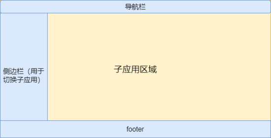
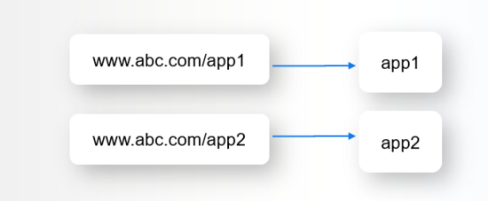

d# 微前端概述

微前端可定义为：一种将独立的前端应用组成一个更大的整体的架构风格。

微前端将前端整体分解，每一块可以独立开发、测试和部署，同时对用户而言仍是一个整体。


## 基本特点和优缺点

微前端架构具备以下几个核心价值：

- 技术栈无关：主框架不限制接入应用的技术栈，子应用具备完全自主权
- 独立开发、独立部署：子应用仓库独立，前后端可独立开发，部署完成后主框架自动完成同步更新
- 独立运行时：每个子应用之间状态隔离，运行时状态不共享。但可以通过消息或 url 的方式来通信。

微前端架构旨在解决单体应用在一个相对长的时间跨度下，由于参与的人员、团队的增多、变迁，从一个普通应用演变成一个巨石应用(Frontend Monolith)后，随之而来的应用不可维护的问题。这类问题在企业级 Web 应用中尤其常见。

微前端在实现上大致可以分为两种实现思路：

- 按页面分解，单实例：在同一时刻只有一个子应用被展示，子应用具备一个完整的生命周期。通常这种实现是依靠路由的，相当于将 spa 的每个路由页面都分为了一个微前端子应用
- 按组件或按功能分解，多实例：一个页面上展示多个子应用，这些子应用可能是页面的一个模块，或者负责部分功能。通常使用 Web Components 方案来做子应用封装，当然也可以使用 react、vue 等框架提供的微前端能力来实现。比如 react 可以让页面的部分内容由 react 控制渲染，其他内容则可以交由静态生成或其他应用负责。

然后再来说下微前端的优缺点：

- 优点：
  - 独立性，包括上面说的独立开发、独立部署、独立运行时，每个子应用有自己的完整的一套开发流程，可以由不同的开发团队来维护。独立性也为整体应用带来更高维护性、更低风险
  - 简单、降低耦合：每个单独的微型前端应用的源代码都将比单个整体前端应用的源代码少得多。这些较小的代码库对于开发人员来说更容易维护。尤其是我们避免了组件间耦合所导致的复杂性。
  - 增量变更：如果我们想大幅度更新应用，实现一些技术栈方面的替换和升级，那么微前端的方式就可以减小重构带来的消耗，我们可以以子应用为单位逐个渐进地升级应用。
- 缺点：
  - 重复依赖：多个子应用之间会有不可避免的重复依赖的情况，类似 react 这样的共用依赖有可能会被下载多次。需要通过一些方式来将这些依赖包和业务代码分离，在共用容器内引入依赖。但考虑到不同子应用的依赖版本不同，并且一个依赖也并不是一定全量引入的（比如组件库可能只需要一部分），如果只是简单的在顶层把这些内容打包进去，就会造成一些更大的问题。
  - 环境复杂：当微应用越来越多，你在本地开发时肯定无法把所有微应用和对应的后端都启动起来，那么你就不得不在本地进行环境的简化。一个应用有自己的开发、测试、线上等多种环境，不同应用之间的环境如何整合，和服务端的配合，都会使得环境越来越复杂。

# 微前端实现

参考：https://zhuanlan.zhihu.com/p/78362028
https://juejin.cn/post/6844903953734336525

## 实现方式

大多数微前端都是以页面为子应用的。从这个角度考虑，其实微前端是一种 MPA 化的 SPA，因此有些实现方式可能类似传统 MPA。
现有的实现方式有：

1. 服务端集成：即通过 Nginx 配置反向代理来实现不同路径映射到不同应用（如下图所示），这样可以实现项目的独立开发和部署。



但同时这种做法也会丢失 SPA 的体验，每一次命中路由都会重新请求资源，不能局部更新当前页面。

2. 运行时集成：使用 iframe ，通过配置不同的 src 加载不同的子应用页面。

```html
<iframe src="https://test.qq.com/a/index.html"></iframe>
```

iframe 自带的样式、环境隔离机制使得它具备天然的沙盒机制。
但 iframe 实现的缺点也很多：比如刷新无法保存状态、不同子应用间难以共享数据等等

3. JS 集成：每个微前端都对应一个 `<script>` 标签，并且在加载时导出一个全局变量。然后，容器应用程序确定应该安装哪些微应用，并调用相关函数以告知微应用何时以及在何处进行渲染。

这一种是主流的实现方式，下面会详细讲解。

```html
<html>
  <head>
    <title>Feed me!</title>
  </head>
  <body>
    <h1>Welcome to Feed me!</h1>

    <!-- 这些脚本不会马上渲染应用 -->
    <!-- 而是分别暴露全局的渲染方法 -->
    <script src="https://browse.example.com/bundle.js"></script>
    <script src="https://order.example.com/bundle.js"></script>
    <script src="https://profile.example.com/bundle.js"></script>

    <div id="micro-frontend-root"></div>

    <script type="text/javascript">
      // 这些全局函数是上面脚本暴露的
      const microFrontendsByRoute = {
        "/": window.renderBrowseRestaurants,
        "/order-food": window.renderOrderFood,
        "/user-profile": window.renderUserProfile,
      };
      const renderFunction = microFrontendsByRoute[window.location.pathname];

      // 渲染第一个微应用
      renderFunction("micro-frontend-root");
    </script>
  </body>
</html>
```

这种方式具有完全的灵活性，可以用 JS 控制什么时候下载每个应用，以及渲染应用时额外传参数。

4. Web Component 集成：主要应用于多实例微前端，即一个页面可能存在不同的组件，这些组件都是一个 Web Component。

```html
<!-- 示例代码类似，其实就是用wc代替了全局方法渲染 -->
<script type="text/javascript">
  // 这些标签名是上面代码定义的
  const webComponentsByRoute = {
    "/": "micro-frontend-browse-restaurants",
    "/order-food": "micro-frontend-order-food",
    "/user-profile": "micro-frontend-user-profile",
  };
  const webComponentType = webComponentsByRoute[window.location.pathname];

  // 渲染第一个微应用（自定义标签）
  const root = document.getElementById("micro-frontend-root");
  const webComponent = document.createElement(webComponentType);
  root.appendChild(webComponent);
</script>
```

## 基本功能

上面说过微前端实现有两种方式，一种是页面，一种是组件。
以一个多页面应用为例，每个页面就是一个子应用。那么要实现的主要功能有：

1. 集成方式：主框架与子应用集成的方式，大体有两种：
   - 构建时组合：子应用打包，作为主应用的一个依赖项一起发布。这个最大的缺点在于如果更新子应用，那么主应用也得更新，主应用下的其他子应用也可能会受到影响。
   - 运行时组合：子应用独立打包，通过 js 动态加载子应用并渲染。
2. 子应用加载：JS Entry vs HTML Entry。在确定了运行时载入的方案后，另一个需要决策的点是，我们需要子应用提供什么形式的资源作为渲染入口？

- JS Entry 的方式通常是子应用将资源打成一个 entry script，比如 下面示例的方式。但这个方案的限制也颇多，如要求子应用的所有资源打包到一个 js bundle 里，包括 css、图片等资源。除了打出来的包可能体积庞大之外的问题之外，资源的并行加载等特性也无法利用上。
- HTML Entry 则更加灵活，直接将子应用打出来 HTML 作为入口，主框架可以通过 fetch html 的方式获取子应用的静态资源，同时将 HTML document 作为子节点塞到主框架的容器中。这样不仅可以极大的减少主应用的接入成本，子应用的开发方式及打包方式基本上也不需要调整，而且可以天然的解决子应用之间样式隔离的问题。

举个栗子：下面这种情况：
```html
子应用 index.html
<script src="//unpkg/antd.min.js"></script>
<body>
  <main id="root"></main>
</body>
// 子应用入口 ReactDOM.render(<App />, document.getElementByI('root'))
```

如果是 JS Entry 方案，主框架需要在子应用加载之前构建好相应的容器节点(比如这里的 "#root" 节点)，不然子应用加载时会因为找不到 container 报错。但问题在于，主应用并不能保证子应用使用的容器节点为某一特定标记元素。而 HTML Entry 的方案则天然能解决这一问题，保留子应用完整的环境上下文，从而确保子应用有良好的开发体验。

Html Entry方法的主要步骤如下：
- 首先通过url获取到整个Html文件
- 从html中解析出html，js和css文本，可以通过正则等方法来解析；
- 在主应用中创建容器，把html更新到容器中，比如子应用依赖的容器是`<div class="main></div>`，那就把这个容器元素注入
- 动态创建style和script标签，把子应用的css和js赋值在其中，最后把容器放置在主应用中。

```js
// 解析 HTML，获取 html，js，css 文本
const {htmlText, jsText, cssText} = importHTMLEntry('https://xxxx.com')
// 创建容器
const $ = document.querySelector(container)
$.innerHTML = htmlText
// 创建 style 和 js 标签
const $style = createElement('style', cssText)
const $script = createElement('script', jsText)
$.appendChild([$style, $script])
```


3. 样式控制：多个微前端应用的样式需要有一定模块化规范。常用的几种方式有：
   - 类名控制，比如 css-module
   - sass、less 提供的嵌套方式，每个微前端应用的样式嵌套在一个命名空间内
   - 行内样式
   - 动态样式，比如一个应用加载时通过动态添加 link 标签来引入样式，卸载时再删除该样式
4. 共享依赖：在不同微应用之间应该要共享一些重用的依赖，比如组件库等。常见的方式是创建一个项目整体的公共组件库，任何人都可以为库贡献代码，但是有一个托管者负责确保这些代码的质量、一致性和有效性。
   - 共享依赖的常见实现方式，是可以在打包时将一些共用依赖，比如 react，到打包到主应用中。然后每个子应用去通过 external 将这些依赖标记为外部库。最后通过 cdn 形式导入主应用 html。
5. 通信：不同微应用之间可能需要通信。比如有一个商品落地页，需要跳转到详情页。落地页和详情页之间需要通信当前具体的商品 id；常见的通信方式有：
   - 自定义 EventBus
   - 利用页面能力通信，比如 localstorage、webworker 等，或者通过全局变量
   - 通过 url 参数进行通信，比如把 id 塞到跳转 url 中，在详情页内就可以获取到具体的商品 id 了
6. js 隔离：单个子应用需要放入一个沙箱内，防止子应用的副作用影响其他子应用。具体实现方法有：
   - 快照沙箱：比如在应用的 bootstrap（初始化入口，还未修改全局） 及 mount（完成挂载，已有可用全局） 两个生命周期开始之前分别给全局状态打下快照，然后当应用切出/卸载时，将状态回滚至 bootstrap 开始之前的阶段，确保应用对全局状态的污染全部清零。而当应用二次进入时则再恢复至 mount 前的状态的，从而确保应用在 remount 时拥有跟第一次 mount 时一致的全局上下文。
   - proxy沙箱，使用proxy代理window，对于每个子应用都代理了一个fakeWindow，这样在查找变量的时候在本地的fakeWindow上查找，如果没有找到就到主应用的window上查找，而修改时只修改本地的fakeWindow，不会影响到其他的应用，在最终卸载时把fakeWindow删除即可。

## 实现步骤

参考：https://juejin.cn/post/6844903953734336525#heading-20

详细内容可以打开上面的参考链接

大致的实现原理如下：

1. 首先我们创建主应用，然后在主应用的 App.js 内部，通过 react-router 来实现路由的切换

```js
<Switch>
  <Route exact path="/" component={Browse} />
  <Route exact path="/restaurant/:id" component={Restaurant} />
</Switch>
```

也可以不用 react-router，直接通过监听路由跳转也行。
这里的 Browse 和 Restaurant，都是子应用；当页面路由跳转时，则会开始动态加载子应用，

2. 子应用组件：

```js
const Browse = ({ history }) => (
  <MicroFrontend history={history} name="Browse" host={browseHost} />
);
const Restaurant = ({ history }) => (
  <MicroFrontend history={history} name="Restaurant" host={restaurantHost} />
);
```

MicroFrontend 组件提供了子应用的统一加载、渲染逻辑：

```js
class MicroFrontend extends React.Component {
  componentDidMount() {
    const { name, host } = this.props;
    const scriptId = `micro-frontend-script-${name}`;

    if (document.getElementById(scriptId)) {
      this.renderMicroFrontend();
      return;
    }
    // 这里是jsEntry方案，即通过加载子应用入口js的方式来加载子应用并执行渲染
    // 如果是htmlEntry，那么这里请求的应该是子应用的入口html，然后根据入口html的script、link等加载所需的资源，并把入口元素document注入到主应用中，再去执行渲染
    fetch(`${host}/asset-manifest.json`) // 获取子应用的资源，比如页面需要的静态资源、js等
      .then((res) => res.json())
      .then((manifest) => {
        const script = document.createElement("script");
        script.id = scriptId;
        script.src = `${host}${manifest["main.js"]}`; // 脚本的src实际上就是子应用的入口js
        script.onload = this.renderMicroFrontend; // 脚本加载完成后执行 renderMicroFrontend渲染子应用
        document.head.appendChild(script);
      });
  }

  renderMicroFrontend = () => {
    const { name, history } = this.props;
    // 这个方法会根据具体的应用（比如Browse）来执行渲染方法
    window[`render${name}`](`${name}-container`, history);
    // E.g.: window.renderBrowse('browse-container', history);
  };

  componentWillUnmount() {
    const { name } = this.props;
    // 卸载子应用时同时卸载渲染方法
    window[`unmount${name}`](`${name}-container`);
  }

  render() {
    return <main id={`${this.props.name}-container`} />;
  }
}
```

3. 渲染方法：每个子应用内部应该有自己的一套渲染方法，在 MicroFrontend 挂载时通过 renderMicroFrontend 来执行渲染。

```js
// Browse组件项目的index.js
// 当路由跳转时会请求这个文件和其他相关资源，并动态通过script插入当前文件
// 当script加载完成时，执行这里的renderBrowse方法，执行渲染

import React from "react";
import ReactDOM from "react-dom";
import App from "./App";
import registerServiceWorker from "./registerServiceWorker";

window.renderBrowse = (containerId, history) => {
  // 实际上就是react的渲染方法
  ReactDOM.render(
    <App history={history} />,
    document.getElementById(containerId)
  );
  registerServiceWorker();
};

window.unmountBrowse = (containerId) => {
  ReactDOM.unmountComponentAtNode(document.getElementById(containerId));
};
```

4. 其他内容，包括样式的处理、路由传参和其他数据通信方式、公共依赖提取等等。

# qiankun
