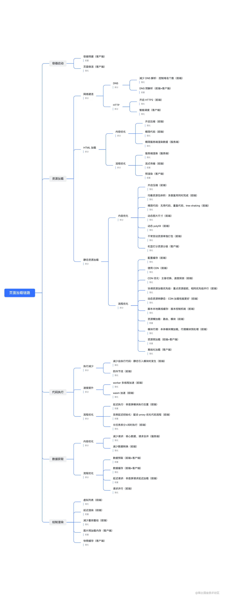
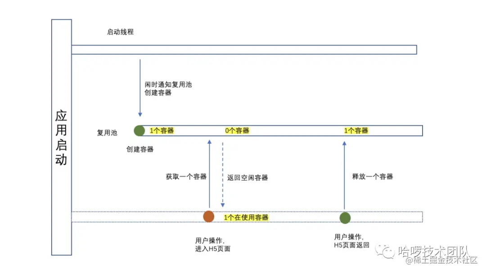
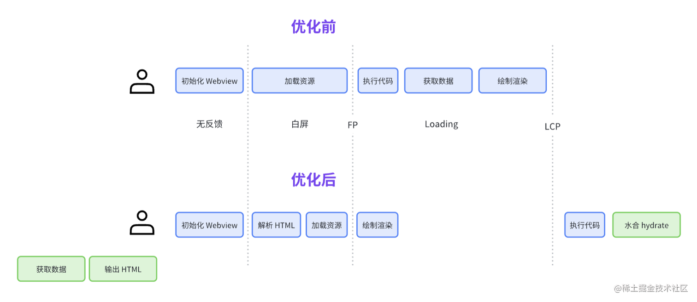
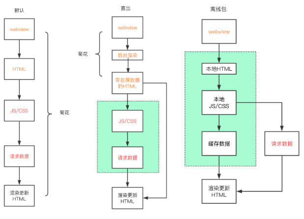
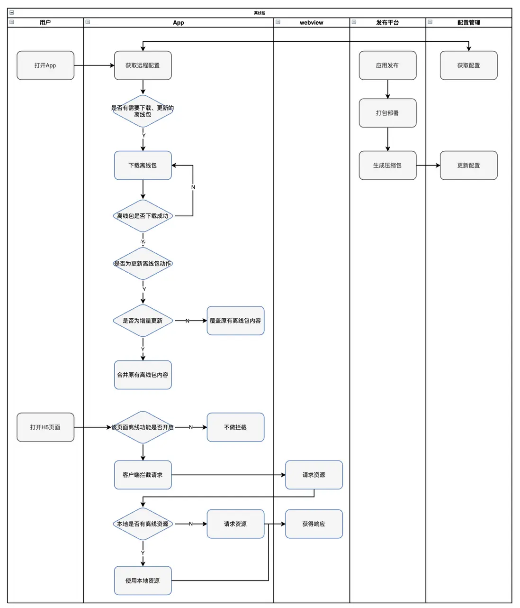
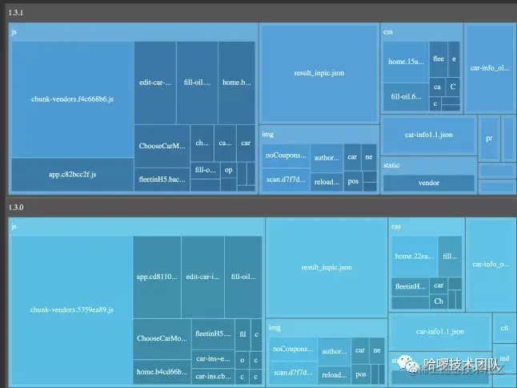

移动端开发相关知识

# 基础知识

## WebApp & HybridApp & NativeApp

1. Web App
   Web App 即移动端的网站，将页面部署在服务器上，然后用户使用各大浏览器访问，不是独立 APP，无法安装和发布。手机淘宝就是一个最常见的 Web App。

- 优点：
  - 开发成本低，可以跨平台，调试方便。
  - 维护成本低 更新无需通知用户，不需要手动升级 无需安装 App，不会占用手机内存。
- 缺点：
  - 无法获取系统级别的通知，提醒，动效等等。
  - 用户留存率低 设计受限制诸多 体验较差。

2. Native App

Native App 就是我们常说的原生 App，分为 Android 开发和 IOS 开发。Android 基于 Java 语言，底层调用 Goolge 提供的 API，IOS 基于 Objective c 或 Swift，底层调用 Apple 官方提供的 Api。

- 优点：
  - 直接依托于操作系统,交互性最强,性能最好。
  - 功能最为强大,特别是在与系统交互中,几乎所有功能都能实现。
- 缺点
  - 开发成本高，无法跨平台，不同平台 Android 和 iOS 上都要各自独立开发。
  - 门槛较高，原生人员有一定的入门门槛，相比广大的前端人员而言较少。更新缓慢，特别是发布应用商店后，需要等到审核周期。维护成本高。

3. Hybrid App

Hybrid App(混合应用程序)，主要原理就是将 APP 的一部分需要动态变动的内容通过 H5 来实现，通过原生的网页加载控件 WebView (Android)或 WKWebView（iOS）来加载 H5 页面。这样以来，H5 部分是可以随时改变而不用发版，动态化需求能满足；同时，由于 H5 代码只需要一次开发，就能同时在 Android 和 iOS 两个平台运行，这也可以减小开发成本，也就是说，H5 部分功能越多，开发成本就越小。我们称这种 h5+原生的开发模式为混合开发，采用混合模式开发的 APP 我们称之为混合应用或 Hybrid APP。
Hybrid APP 基本都存在一个 JSBridge，用于和 native 做交互。

- 优点：
  - 开发成本较低，可以跨平台，调试方便 维护成本低，功能可复用。
  - 功能更加完善，性能和体验要比起 web app 好太多，更新较为自由。
- 缺点：
  - 相比原生，性能仍然有较大损耗，不适用于交互性较强的 app。

hybrid app 可以再细分为三类

- 基于 webview 的 app，如常见的端内 h5
- 基于 native 的 app，如 rn
- 小程序

## h5

h5 通常指的是移动端的网页，可以理解为 html5 的简称。
相对于传统的 web 来说，h5 要考虑更多的移动端上的问题。并且 h5 可以被投放到 native 同期内成为端内 h5，可以和 native 代码通信，调用 native 的方法来做更多的事情。

因此 h5 有一些开发的关键知识，需要注重：

### 像素

移动端的像素主要有几种：

- 设备像素
  设备像素也叫物理像素，是屏幕上最小的显示单元，即设备上真实的物理单元，在设备生产的时候就已经定好。(iphone6 750px)一般比独立像素大。
- 独立像素
  独立像素(DP 或 Dip)是一种虚拟像素，是逻辑上衡量像素的单位，不缩放的情况下等于 css 像素。(iphone5 320px iphone6 375px)。注意页面缩放比为 1 时独立像素才和 css 像素相等。如果页面放大一倍（\*2），那么一个 css 像素就相当于 2 个独立像素，以此类推
- 设备像素比
  设备像素比 dpr 就是设备像素和独立像素的比例。比如 iphone6 的 dpr 就是 2，iphone6 Plus 的 dpr 就是 3。

在 web 中，浏览器为我们提供了 window.devicePixelRatio 来帮助我们获取 dpr。在 css 中，可以使用媒体查询 min-device-pixel-ratio 获取 dpr。在 React Native 中，我们也可以使用 PixelRatio.get()来获取 dpr。

```css
@media (-webkit-min-device-pixel-ratio: 2), (min-device-pixel-ratio: 2) {
}
```

屏幕的像素密度越高，就需要更多的设备像素来显示一个设备独立像素，也就是说 dpr 就越高，一个独立像素可以表示更多的设备像素。

- CSS 像素
  在 CSS 中使用的 px 都是指 css 像素，比如 width: 128px。css 像素的大小是很容易变化的，当我们缩放页面的时候，元素的 css 像素数量不会改变，改变的只是每个 css 像素的大小。也就是说 width: 128px 的元素在缩放 200% 以后，宽度依然是 128 个 css 像素，只不过每个 css 像素的宽度和高度变为原来的两倍。如果原本元素宽度为 128 个设备独立像素，那么缩放 200% 以后元素宽度为 256 个设备独立像素。

css 像素与设备独立像素的关系

- 缩放比例就是 css 像素边长/设备独立像素边长；
- 在缩放比例为 100% 的情况下，1 个 css 像素大小等于 1 个设备独立像素；
- 在缩放比例为 200% 的情况下，1 个 css 像素大小等于 (2 \* 2) 个设备独立像素；
- 在缩放比例为 50% 的情况下，1 个 css 像素大小等于 (0.5 \* 0.5) 个设备独立像素；

---

除了像素，还有一些其他关于设备尺寸的单位

- P，比如 720P、1080P，表示屏幕纵向像素个数。比如 1920\*1080 的屏幕就是 1080P
- K，横向像素个数，1K 是 1024，常说的 2K 就是 2048，4K 就是 4096.
- 寸、英寸：设备斜对角连线的长度，1 英寸 = 2.54 厘米
- PPI：每英寸包括的像素数（物理像素）。PPI 可以用于描述屏幕的清晰度以及一张图片的质量。使用 PPI 描述图片时，PPI 越高，图片质量越高，使用 PPI 描述屏幕时，PPI 越高，屏幕越清晰。
  PPI 的计算方式：设该图片或某个区域内的宽为 x 像素，高为 y 像素，屏幕英寸数为 inch，那么`PPI = sqrt(x^2 + y^2) / inch`，相当于一个比例值。
- DPI：即每英寸包括的点数。对屏幕来说点数就是像素数，因此 DPI 和 PPI 在表示屏幕时是一样的。
  DPI 也会用于表示打印机的打印点数，DPI 越高打印结果越细腻

### 视口

关于视口的讲解在 HTML 的那篇博客中已经有，这里提一下更多的内容：

viewport 的缩放，可以作为适配方式的一种。
一般来说 initial-scale 都会设置为 1.0，表示初始时候页面不进行缩放。
不进行缩放表示的含义是，`1个css像素 = 1个独立像素 = n个物理像素`
如果`initial-scale=0.5`，那么相当于`1个css像素 = 0.5个独立像素 = 0.5n个物理像素`
这有什么用呢？假如我们的设计稿是 750px 的，但实际屏幕是 375px 的。在设计稿上 10px，对应到实际屏幕应该是 5px；但如果我们把`initial-scale=0.5`，相当于 css 内的所有 px 自动变为原来的一半，也就是说 10px 在就表示原来的 5px。这样我们就可以直接把设计稿上的宽度赋给 css 了，而不用做计算。

更通用的，`initial-scale=设备宽度 / 设计稿宽度`

### 适配方案

所谓适配方案其实就是让布局能在不同像素的设备上正常显示。常见的适配方案有：

1. 媒体查询：其实就是根据屏幕大小来修改单位，比如：

```css
@media screen and (min-width: 375px) {
  .box {
    width: 160px;
  }
}
@media screen and (min-width: 750px) {
  .box {
    width: 320px;
  }
}
```

很显然这种写法在修改大的布局时会有效，而像素级别的修改肯定是不行的

2. rem

rem、rpx、vw/vh 这三个布局本质上是相同的，后两者其实相当于固定版的 rem。
rem 布局的本质就是让像素动态化，我们的样式是固定的 rem 值，但 rem 值对应的像素值会变化，因此最终表现的像素值也能适配。

rem 的计算参考 css 部分。

实际上，由于 rem 和 vw 都是相对单位，他们和 px 没有直接关系，因此大多数时候要达到的效果是：**在代码里写 px，由工具转为 rem/vw**。
转化的工具就是 postcss 插件。比如 postcss-px-to-viewport 可以转化 vw，postcss-px-to-rem 可以转化 rem。
通常需要配置一个 rootValue，比如 rem 插件中这个值就表示在设计稿上 1rem 等于多少像素。

另外 rpx 其实是比较特殊的，rem 和 vw 布局本质还是写 px，但 rpx 布局就直接写 rpx。因为 rpx 是和设计稿绑定的；比如设计稿通常是 750px，那么 1rpx 其实就相当于 750px 屏幕上的 1px.所以直接写 rpx 就可以，由处理器按比例转化为实际的 px。

### 横竖屏

在某些特定横屏或者竖屏的情况下的样式我们可以通过如下@media 查询进行设置。

```css
/* 竖屏 */
@media all and (orientation: portrait) {
  /* 自定义样式 */
}

/* 横屏 */
@media all and (orientation: landscape) {
  /* 自定义样式 */
}
```

js 也可以：

```js
window.addEventListener(
  "onorientationchange" in window ? "orientationchange" : "resize",
  function () {
    if (window.orientation === 180 || window.orientation === 0) {
      alert("竖屏状态！");
    }
    if (window.orientation === 90 || window.orientation === -90) {
      alert("横屏状态！");
    }
  },
  false
);
```

不过要注意的是，这种方式只能判断由手机旋转而得到的变化。有时候打开软键盘将导致视口 viewport 的宽度大于高度，从而导致浏览器突然改用横向样式。

# 优化

## 概述

将 H5 接入 App 中通常有两种方式：

- 在线 H5，只需要将 H5 代码部署到服务器上，只要把对应的 URL 地址 给到客户端，用 WebView 打开该 URL，即可嵌入。通常，这种方式更适用在一些比较轻量级的页面上，例如一些帮助页、提示页、使用攻略等页面。这些页面的特点是功能性不强，不太需要复杂的功能协议，且不需要离线使用。
- 内置包 H5，这是一种本地化的嵌入方式，我们需要将代码进行打包后下发到客户端，并由客户端直接解压到本地储存中。通常我们运用在一些比较大和比较重要的模块上。

通常的 h5 优化主要有两个方面

- 一是秒开，即首屏优化。因为上面两种 h5 接入方式都存在首屏加载速度慢的问题
- 二是一些其他的专项优化，比如图片、视频等，或者流畅度等指标的优化

参考：
https://juejin.cn/post/7249665163242307640
https://xiaobaiha.gitbook.io/tech-share/engineering/c-duan-xing-neng-you-hua
https://juejin.cn/post/6986951532742705159#heading-39
https://www.androidos.net.cn/doc/2020/10/8/349.html
https://juejin.cn/post/6949103404266291231
https://godbasin.github.io/2022/08/14/front-end-performance-container/
http://www.alloyteam.com/2019/10/h5-performance-optimize/
https://segmentfault.com/a/1190000041701111

## 优化大纲

https://juejin.cn/post/7249665163242307640

h5 优化按照不同方式分类有不同的结果：

- 按页面加载链路分类：**容器启动、资源加载、代码执行、数据获取、绘制渲染**。
- 按资源性能分类：**CPU、内存、本地 I/O、网络**。该分类方法又被叫做 USE 方法（Utilization Saturation and Errors Method）。
- 按协作方分类：**前端、客户端、数据后台、图片服务、浏览器引擎**等。
- 按流程优化分类：**前置、简化、拆分**。
  - 前置即调整流程，效果上可能是高优模块前置或并行，低优模块后置；
  - 简化即缩减或取消流程，体积优化是简化，执行加速也是简化；
  - 拆分即细粒度拆解流程，本身没有优化效果，是为了更好的进行前置和简化。
- 多级分类：使用多个层级的分类方法。比如先按页面加载链路分类，再将链路中的每一项用协作方或者流程优化等角度再次分类。突出的是一个系统性思维。

整体优化大纲：



其实针对这里的优化内容，还可以再做一次分类。
有些优化方式是比较通用的，比如优化包体积、压缩代码等；但有些优化是需要借助 native 来实现的，比如缓存、预加载、离线化等等。需要关注的重点其实就应该是这些专项的优化方式。

下面根据大纲内容来整理 h5 秒开优化的主要方法

## 优化方式

### 容器启动

容器方面主要有两个优化：

1. 容器的预加载和复用。

WebView 容器本身是一个内存消耗大户，可以借鉴了线程池的概念，利用系统空闲时机，预先创建 Webview 对象池，将容器预载在内存中，需要使用 WebView 时直接从池中对象获取对象，用对象池一次创建多处复用的方式避频繁创建导致的耗时和内存抖动。



2. 保活：和 rn 的保活思路类似，webview 页面卸载之后并不理解销毁 webview，而是通过一些手段延迟销毁，这样如果再次进入就仍然可以复用上次创建的容器。不过保活在 h5 里应用较少，可以不做深究

### 资源加载

1. 网络（建立）连接优化

这部分主要就是一些常规的网络优化方式，比如 DNS 预解析、TCP 预连接等，还有 http2 等优化。

2. HTML 加载

可以再分成几部分：

- 内容优化：包括 html 结构精简、压缩等。需要注意的是如果采用 SSR/SSG 来直出的话，页面上的脱水数据也要做精简来减小 html 体积。
- 流程优化：
  - ssr/ssg，本质上是一种数据直出方案。和 web 端的服务端渲染方式类似
  - 预渲染：预渲染不同于服务端渲染，他是一种客户端渲染方式，相当于提前调用 webview 的 loadUrl 方法，将页面完全渲染出来，当使用的时候直接展示。ssr 只是跳过了 spa 的渲染过程，但预渲染相当于将整个 html 渲染过程都已经完成了，当需要的时候直接展示即可。
  - 流式渲染：传统渲染方式，html、css 等资源都是以文件为单位，当全部接收之后才会开始解析和渲染。流式渲染提供了一种可以类似流的思路来渲染，即收到一部分就解析渲染一部分，可以提升渲染速度。

#### 预渲染

https://juejin.cn/post/7120907970031910942

预渲染是在客户端（如移动应用程序或浏览器）中进行的。在预渲染过程中，网页的内容在客户端被提前加载和渲染，并保存为静态文件或数据。当用户访问网页时，预渲染的内容可以直接被展示，无需再次请求和渲染整个网页。

预渲染过程会完成整个初始的渲染流程，包括 js 的执行。因此预渲染相当于是“模拟”访问了一次页面，完成了首次渲染的过程。
但对于动态性较强的页面，比如页面的 js 每秒都会刷新业务接口，预渲染一般只会保留首次的渲染结果。不过可以让页面在客户端显示之后，继续完成动态化内容。

预渲染有一些注意点：

1. 目标选择：预渲染需要在进入 app 之后，在一定时机内告知需要渲染哪些页面。考虑到 native 的内存，一次预渲染的页面不能太多，一般一到两个就可以了。

2. 时机选择：一般有三种：

   - 主线程闲时阶段，在 app 启动之后的空闲时间可以预渲染一部分内容
   - 在关闭预渲染页面时重新进行预渲染，假设预渲染了页面 A，那么用户在访问完页面 A 后，我需要再次预渲染页面 A，从而保证页面 A 的实效性。
   - 手动控制预渲染，提供 api 给开发者来手动调用预渲染，当然也需要在合适的时候销毁预渲染的页面

3. 有效性检查，主要有两点
   - 时间有效性：在预渲染时为页面设定过期时间，如果访问时超过了过期时间就重新渲染，防止出现页面过期的情况
   - 状态有效性：主要是应对渲染失败或异常的情况。假设我们在网络异常状态下去进行了预渲染，在网络恢复正常后用户访问预渲染页面，就应该检查预渲染结果是不是正常的，如果是失败的结果就不展示，而是重新渲染。

预渲染的最大问题在于刷新时机难以保证。理论上刷新预渲染结果只能通过三个方式

- app 重启
- 用户访问之后退出再重新访问
- 业务手动调用

其他时候，复用的都是之前创建的页面。因此对于实时性强的页面并不适用于预渲染。

#### NSR

NSR（Native Side Render）：利用客户端原生做 SSR。核心思路是利用客户端启动一个 JS 引擎，执行数据请求 + HTML 文档输出，并将结果缓存。在后续的页面加载过程中，直接渲染 HTML 文档，并做 hydrate （水合）处理。

注意 NSR、SSR、预渲染三者区别。虽然 NSR 其实也是预渲染的一种，但他并没有提前启动 webview，只是在 native 侧做了 ssr 在服务端做的事情：预取数据生成 html。



NSR 的本质是一个“分布式的 SSR”，既能实现 ssr 的效果，同时又不会给服务端带来太大压力。

详细可以参考
https://www.infoq.cn/article/9ukos4xh_6wl4fh1fogl
https://juejin.cn/post/7267436042507911179#heading-14

#### 静态资源加载

还是从两个方面来分析：内容和流程

1. 内容优化，即资源本身属性的优化
   - 代码优化，包括压缩、精简、tree-shaking、删除无用等等常规的方式
   - 图片资源专项优化，比如动态分辨率、格式等，下面会详述
   - 分包，将业务代码和依赖代码分离，对依赖代码做好缓存
2. 流程优化，是资源加载的重点，主要是通过缓存、前置等方式来优化加载静态资源的时机，从而提升观感。
   - CDN
   - 资源缓存
   - 离线包
   - 资源预加载
   - 资源懒加载

这些内容都非常重要，下面会详细讲解

##### 缓存

对 h5 来说，可以使用到的缓存有很多种

- HttpCache：通过一定规则让网络回来的资源缓存在本地，下次使用的时候可以直接从本地读取。有一些工具可以允许资源在过期之后，在一段时间内可以继续使用，同时发起一个异步请求，可以允许资源先使用，再验证。
- LocalStorage：前端可以使用 LocalStorage 将资源存储在本地，类似的还有 IndexedDB。LocalStorage 也有一些限制，比如一个域名只能存储 5M 数据，不能跨域读取。
- MemoryCache：内存缓存， Chrome 中的 MemoryCache 主要由 GC 管理，资源进入 MemoryCache 的时候会关联一个弱引用，在主文档关闭的时候会被清除。
- 离线包（ZCache）：webview 对 url 请求做拦截，将请求结果保存在客户端本地。下一次请求的时候采用离线结果。
- NetCache：DNS 解析结果，长连接复用。
- V8 Bytecode Cache：V8 字节码缓存。【JS 执行过一次，第二次执行能明显减少时间】。
- Image Decode Cache：图片解码缓存。
- PageCache：页面级缓存，当路由跳转时，前一个页面可以被缓存

缓存相关的优化，大致也可以分为几类

1. 基础 http 缓存优化，和常规在 web 端上使用优化的方案一样，通过响应头来做优化。在 h5 中这些优化策略也能生效，由 webview 提供缓存的管理。
2. storage api、indexDB，这些是可以由前端控制的缓存。主要可以用于一些代码逻辑上的缓存优化，但对页面首屏加载的优化效果不大
3. 离线缓存：离线缓存有几种主要的实现方式：
   - 利用 webview 对请求拦截
   - 利用 pwa 实现的缓存
   - 本地 Web Server，将请求对象从服务器替换为本地 server，类似开发模式下的方式。这种方式支持性较差，而且开启 server 对客户端影响很大，因此几乎没有再使用的
   - prefetch 方案：是一种比较新的方案，利用 html 的 prefetch 来进行预下载，作为离线资源使用

##### 离线包

上面说过离线包有几种主要的实现方式，下面依次讲解

1. 请求拦截：基本思路是借助 native 通过 webview 统一拦截 url，将资源映射到本地离线包，打开或者更新应用的时候对版本资源检测，下载和维护本地缓存目录中的资源。





这种属于是最通用的离线包方式。当然也有一些注意点：

- 下载时机：一般是 app 启动的时候在空闲时间下载保存。可能会每间隔一段时间会去服务器请求一次，进行全量或增量更新。app 在应用商店一般是不包含离线包的，都是在下载启动之后才会开始离线包策略。
- 内容：一般是页面加载需要的 html/css/js 资源，以及一些 img、json 等静态资源。考虑到大小问题，不一定会包含全部资源，而是要根据实际需求筛选。（一般不会包含业务接口数据）

举个栗子：

- 更新和替换时机：一般可以在打开对应的 h5 页面时对匹配的离线包进行检查，如果过期就更新离线包并取线上资源。更进一步还可以在每次页面关闭时就更新，保证下一次打开时能取到最新的离线包资源。当然轮询更新也是必不可少的
- 下载错误处理：离线包本质也是资源的一种，因此需要合适的重试、下载队列、并发下载、弱网络延迟下载等优化方式来尽可能降低离线包下载错误的影响，同时也要对下载不全的资源进行合理的抛弃和兜底，防止影响资源的加载。
- 实现原理和差异：安卓上是利用 shouldInterceptRequest 进行拦截；ios 上非常麻烦，多种实现方式都有丢失 body、丢失 cookie 等问题，且 ios 不能做掉部分接口的拦截，所以从效果上也弱于安卓。
- 增量更新：可以参考[这篇文章](https://zhuanlan.zhihu.com/p/34125968)。简单来说增量更新就是服务端在下发离线包的时候，下发的不是包本身，而是和之前版本包对比生成的一个 patch，只包含修改和新增的内容。客户端下载到该 patch 文件后，和打包到 app 里面的原始文件 merge，生成最新包;
- 其他优化，比如下载去重、并行下载、预下载等

2. pwa：pwa 主要利用 service worker 进行缓存。

关于 service worker 的详细内容在 html 博客中有详细介绍，这里只要知道他可以提供给 js 以缓存能力，控制资源、业务接口数据的缓存。

但 pwa 最大的问题在于缓存一般是第二次进入页面才生效，首次进入的时候才是“放入”缓存的时候。针对这种情况可以在页面加载之前先加载一个 js 文件，包含有 service worker 相关的内容，这样在首次进入时就可以使用到缓存结果了。

举个例子，参考 https://zhuanlan.zhihu.com/p/148931732 ，在 app 启动时就执行 sw 的缓存过程来缓存其他页面所需的 js、css 等资源；
在合适的实际派发 preload 事件，让 sw 获取并解析页面的 html，对图片等静态资源进行下载并缓存。
最后当页面打开时，直接从 sw 中取数据。

```js
var sharedResourcesToCache = ["https:/xxx.com/h5.css"];

self.addEventListener("install", function (event) {
  event.waitUntil(
    caches.open(cacheName).then(function (cache) {
      return cache.addAll(sharedResourcesToCache);
    })
  );
});

// preload

self.addEventListener("preload", function (event) {
  var fetchAndCache = fetch(request).then(function (response) {
    response
      .text()
      .then(function (responseStr) {
        var subResourcesList = responseStr.match(/(http|\/\/)([^'"]+)/g) || [];
        return subResourcesList.filter(function (url) {
          return url.match(/(png|jpg|jpeg|gif)$/i);
        });
      })
      .then(function (imgResources) {
        imgResources.forEach(function (imgUrl) {
          fetch(imgRequest).then(function (imgResponse) {
            caches.open(cacheName).then(function (cache) {
              cache.put(imgRequest, imgResponse.clone());
            });
          });
        });
      });
  });
  event.respondWith(fetchAndCache);
});
```

还有一个问题是，ios 对 pwa 的支持很差，如果想要通过 pwa 来实现离线包的话，就需要自行在 ios 上实现 service worker。

3. prefetch 方案，原理是利用 html 的 prefetch，在页面下载之前先加载几个包含 prefetch 的 html，让资源先行下载。之后利用天然的预请求机制来实现数据缓存。这种方案优势在于对 webview 侵入小，不需要拦截请求，也不需要覆写 fetch 等方法。

参考： https://juejin.cn/post/7011837444865654797

---

离线包有一个通用的问题，就离线包很容易变得体积很大。
这种情况有一个解决方法，就是将离线包和 ssr 结合起来。比如入口 html 文件保持 SSR，其他静态资源借助离线化。这样也能保持入口 html 的及时更新。

##### 懒加载

这里的懒加载主要是针对资源的懒加载，包括模块、图片等内容

常见的就是图片懒加载，可视区域判断。
模块的话主要是路由懒加载，以及非首屏模块的拆分，数据驱动加载等等方式。

这里着重说一下图片懒加载的方案。图片懒加载有两个重点：

- 如果判断加载时机
- 如何加载一张图片

1. 第一种常用的方案，是利用图片的 data-src 属性先保存 url，在图片进入可视区域之后通过把 src 设为 data-src 上保存的 url 来实现加载。

这种方案需要监听页面滚动，每次滚动事件触发时遍历所有的 img 元素，通过 getBoundingClientRect 来计算是否进入可视区域，如果进入的话就修改 img 元素的 src

注意 img 元素需要有默认占位。要么是在文档流中有准确的布局位置，要么就是有兜底图片，否则初始化 img 元素为空，可能计算得到的 top 都为 0

还有一点很重要，要尽量避免图片 src 为空，虽然 src 属性为空字符串，但浏览器仍然会向服务器发起一个 HTTP 请求。解决方法是使用本地的占位图，或者一个 base64 格式的空白占位图片。

```js
// 懒加载-回调函数
function lazyLoad() {
  const imgs = document.querySelectorAll("img[data-src]");
  if (!imgs.length) return;
  imgs.forEach((img) => {
    const rect = img.getBoundingClientRect();
    if (rect.top < window.innerHeight) {
      img.src = img.dataset.src;
      img.removeAttribute("data-src");
    }
  });
}
window.onload = () => {
  // 全局监听scroll滚动事件
  window.addEventListener(
    "scroll",
    throttle(() => {
      lazyLoad();
    }, 100)
  );
  // 初始化的时候执行一下加载图片的函数
  lazyLoad();
};
```

这种方案的弊端很明显，每次滚动都会引起大量计算

2. 第二种方案是利用 Intersection Observer API，初始化对所有 img 元素做监听。每次 observer 回调触发时，就把变化的那个 img 元素做修改即可。

```js
const io = new IntersectionObserver((entries, observer) => {
  entries.forEach((entry) => {
    if (entry.intersectionRatio > 0) {
      const img = entry.target;
      if (!img.dataset.src) return;
      img.src = img.dataset.src;
      img.removeAttribute("data-src");
    }
  });
});

const oberverImages = () => {
  const imgs = document.querySelectorAll("img[data-src]");
  imgs.forEach((img) => {
    io.observe(img);
  });
};
```

##### 预加载

预加载的常用方案其实在离线包里已经提到过了。
从本质上来说，离线包也是一种预加载；不过严格来说准确的预加载应该是一种保存时间较短、数据较新、更偏向静态资源的一类缓存。通常在我们访问一个页面之前通过预加载的方式提前加载好图片等资源，以方便打开时能加快资源的加载。

还有一个区别在于，离线包通常是 app 启动时下载，定时更新的。但预加载拥有更高的灵活性，可以在特定时间点加载并缓存，同时也不存在对请求的拦截和修改。但与此同时，在缓存时效和效果上也就比离线缓存稍逊一筹。

常见的实现方式：

- pwa：和离线包实现方式类似，提前加载 sw.js 文件来预取数据并缓存
- prefetch：同上，提前加载一个包含 prefetch 的 html 来实现数据的预取

### 代码执行

代码执行更多体现在代码质量本身，包括使用 react 等框架时，通过一些手段降低 js 执行的消耗。

常见的优化方式有：

- 执行减少，比如防抖节流、框架渲染优化等
- 速度提升，通过 web worker、wasm 等工具来实现加速
- 流程优化，比如长任务时间分片、非首屏模块延后执行等，也就是在 rn 这类框架里的渲染优化。

### 数据获取

数据获取一般是指业务 api 的请求。和页面初始化的资源加载不同，一般业务数据会体积稍小一些，并且执行时机也是在资源加载之后。
对数据获取的优化可以分为几个方面：

- 内容优化：
  - 接口精简、接口合并
  - 接口数据序列化
- 流程优化
  - 数据预取
  - 数据缓存
  - 延迟请求，非首屏模块延迟请求
  - 并行请求

这里数据预取和缓存方案类似于资源加载的预加载和缓存，不过更多是依靠客户端代码的自定义实现。常见的实现方式：

1. 请求前置：

客户端会在 App 启动后获取配置，保存支持预请求的页面地址及对应的接口信息，在用户打开 webview 时，会并行发起对应预请求的接口，并保存结果。当 JS 执行开始获取首屏数据时，会先询问客户端是否已经存有对应的响应数据，如果此时已经拿到数据则无需发起请求，否则 js 也会发起接口请求并开启竞速模式。

2. 预请求：

通过 pwa 等方式，提前把业务接口数据请求并保存。当页面加载时检查缓存，如果数据合法就使用，否则兜底去请求线上数据。
这种方法存在一些问题：

- 预请求的接口数量，考虑到预请求的命中率，有些接口可能缓存了但是后续访问较少，因此需要斟酌
- 刷新，要考虑预请求数据的更新时机和缓存时间控制。

3. ssr，将数据直接直出，相当于跳过了数据获取的过程。

### 绘制渲染

这一部分就是一些渲染方面的优化，主要包括：

- 大量元素优化：渲染时间分片、虚拟列表
- 减少重绘重排、gpu 加速
- 图片内存优化：通常不要“小容器装大图”，尤其是在 rn 上，可以根据容器预估大小来请求对应分辨率的图片

其他的就是一些专项优化，目的都是提高流畅度，减少卡顿。
