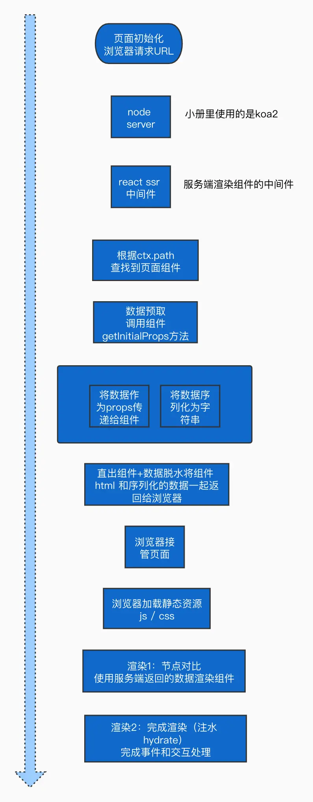

# SSR 概述

SSR 是 JSP、PHP 时代就存在的古老的技术，只不过之前是通过模版引擎，而现在是通过 node 服务渲染组件成字符串，客户端再次渲染，这种叫做同构渲染的模式。

React SSR 是服务端通过 renderToString 把组件树渲染成 html 字符串，浏览器通过 hydrate 把 dom 关联到 fiber 树，加上交互逻辑和再次渲染。

服务端 renderToString 就是递归拼接字符串的过程，遇到组件会传入参数执行，遇到标签会拼接对应的字符串，最终返回一段 html 给浏览器。

浏览器端 hydrate 是在 reconcile 的 beginWork 阶段，依次判断 dom 是否可以复用到当前 fiber，可以的话就设置到 fiber.stateNode，然后在 completeWork 阶段就可以跳过节点的创建。

# SSR 原理

## SSR/CSR/React SSR

关于 ssr 和 csr 的区别，其实可以看这张图来更直观地感受：


ssr 其实是传统 ssr 的代指。现代 ssr 的代表则是 react ssr，它并不等同于传统 ssr 的直接把数据嵌入页面内输出，而是结合了 ssr 和 csr 的优点的产物。
第一次打开页面是服务端渲染，基于第一次访问，用户的后续交互是 SPA 的效果和体验，于此同时还能解决 SEO 问题

> csr 的优缺点自然不必多说，ssr 的有一个缺点就是所有页面的加载都需要向服务器请求完整的页面内容和资源，访问量较大的时候会对服务器造成一定的压力。这在现代 ssr 中也是无法避免的

## React ssr 基本原理

全流程大致如下图：



react ssr 能实现现代 ssr 的关键点有几个：

### 同构组件

同构指的是一个组件既能在客户端渲染，也能在服务端渲染，并且在两端的渲染结果一致，客户端可以直接复用服务端渲染出的组件，然后在组件的基础上判断已有的 DOM 结构和浏览器渲染出的结构是否相同，若相同，则不重复渲染，只需要绑定事件即可。

react 利用虚拟 dom 可以实现同构组件，同时通过一些方法可以判断比较两个组件是否为同构，然后执行复用等操作。

比如最出名的是 renderToString 方法

```js
const html = renderToString(reactNode);
```

他可以将 React 树渲染为 HTML 字符串，然后将该字符串返回给浏览器端，完成页面内容的初始化，同时让搜索引擎可以抓取你的页面来达到优化 SEO 的目的。

在 react 16 前该方法生成的 html 内容的每一个 DOM 节点都有一个 data-react-id 属性，这个属性可以用于完成双端对比；渲染时，react 在浏览器端会计算出组件的 data-react-checksum 属性值，如果发现和服务端计算的值一致，则不会进行客户端渲染。

在 react16 之后提供了 hydrate 方法，通过调用`ReactDOM.hydrate()`可以实现在客户端渲染同构组件、完成事件绑定等工作。

除了 renderToString 之外还有几个类似的方法：

- `renderToNodeStream`：将渲染结果以流形式输出，而不是 string；组件渲染为字符串，是一次性处理完后才开始向浏览器端返回结果。而采用流的话，可以边读边输出，可以要让页面更快的展现，缩短首屏展现时间。
- `renderToStaticMarkup`：将非交互的 React 组件树渲染成 HTML 字符串，也就是说 react 不会在客户端为其绑定事件，它生成的是一个完全静态的结构
- `renderToStaticNodeStream`：同上，只是改成用流来输出

另外，同构组件在客户端和服务端执行有很大的差异，包括一些 api 调用的差别，一些生命周期不会执行等。详细内容在下面会解释

### 路由同构

路由同构的主要目的是在前端实现 spa 的路由功能。
实现路由的关键在于，没必要在客户端和服务端各用一套工具来实现，而应该还是采用同构的思想，让双端维护同一套路由。

举个栗子，比如说有`/home`、`/user`、`/login`等多个页面，那么我们需要做的是第一次加载时，服务端接收请求，根据当前的 path 来查找具体的路由，然后根据路由得到具体的组件，然后将组件直出。服务端直出后，页面由浏览器接管，后面的渲染执行就交给前端代码了。

以 react-router 为例，客户端的路由方式和正常的 spa 一样：

```jsx
<BrowserRouter>
  <Switch>
    <Route path="/root" exact={true} component={Root}></Route>
    <Route path="/list" exact={true} component={List}></Route>
  </Switch>
</BrowserRouter>
```

同样维护一个 index.js：

```js
ReactDom.hydrate(
  <BrowserRouter>
    <App routeList={routeList} />
  </BrowserRouter>, //改成路由组件
  document.getElementById("root")
);
```

在服务端，react-router 提供了一个 StaticRouter 来进行服务端的路由处理；
服务端的路由处理是做什么呢？就是接受来自客户端的请求，根据请求的 path 来匹配不同的组件

可以看到下面代码里把单个组件的 html 替换为了用 StaticRouter 包裹的路由。我们通过 request.path 获取到来自客户端的请求路径后，生成对应的路由组件的 html，后面的过程就和正常的渲染一样。

不过要注意的是，这个请求只会在页面首次加载的请求时执行并返回对应的路由。比如首次请求的是`/login`，那么就会渲染 login 路由下的内容；之后其他的内容，比如通过前端路由切换到`/home`，则由客户端的路由控制

```js
export default (ctx, next) => {
  //获得请求的 path
  const path = ctx.request.path;

  //渲染组件为 html 字符串
  const html = renderToString(
    <StaticRouter location={path}>
      <App routeList={routeList}></App>
    </StaticRouter>
  );
  ctx.body = `<!DOCTYPE html>
<html lang="en">
<head>
    <meta charset="UTF-8">
    <title>my react ssr</title>
</head>
<body>
    <div id="root">
       ${html}
    </div>
</body>
</html>
</body>
<script type="text/javascript"  src="index.js"></script>
`;

  return next();
};
```

### 数据同构

组件的一些数据需要从接口异步获取后进行渲染，数据同构就是服务端和客户端能够使用同一个数据请求处理方法（一套代码），同一份数据进行组件的渲染。

数据同构有几个关键点：

- 服务端如何获取到请求数据的方法？
- 服务端获取数据之后怎么注入代码？
- 服务端如果直接把数据注入 html，那么和客户端组件就不是同构了（填入了数据），怎么让两端能继续保持同构？
- 客户端初始进入的不是目标页面，比如初始进入的是`/home`，再点击路由进入`/list`，但 list 不是由服务端生成的，怎么获取数据？

下面来依次解决这些问题

#### 服务端预取

1. 服务端如何获取到请求数据的方法？利用组件的 static 方法，在服务端获取到组件约定的数据请求方法。

比如编写组件时写一个 static 方法：

```js
export default class Index extends React.Component {
  //静态方法  数据预取方法
  static async getInitialProps() {
    //模拟数据请求方法
    const fetchData = () => {
      return new Promise((resolve) => {
        setTimeout(() => {
          resolve({
            code: 0,
            data: tempData,
          });
        }, 100);
      });
    };

    let res = await fetchData();

    return res;
  }

  render() {
    return <div onClick={this.handlerClick}>hello world。</div>;
  }
}
```

> 如果是函数组件的话，可以参考 umijs 的方法，给函数组件也挂载一个属性：
>
> ```js
> const Home = (props) => {
>   const { data } = props;
>   return <div>{data.title}</div>;
> };
>
> Home.getInitialProps = async (ctx) => {
>   return Promise.resolve({
>     data: {
>       title: "Hello World",
>     },
>   });
> };
> ```

下一步需要在服务端调用这个方法。但是这里有一个问题，怎么得知具体是哪个组件正在渲染，需要预取数据呢？

之前我们通过 path 和 StaticRouter 来匹配，实际上是利用的 react-router 内部封装的能力，只是能把组件渲染出来，但对我们来说是不透明的。但我们现在的目的是找到这个组件，然后取到其上面的 getInitialData 方法来预取数据。

因此这里需要匹配路由。react-router 提供了 matchPath 方法，可以检查当前的 req.path 和配置路由的 path 是否匹配：

```js
const match = matchPath("/users/123", {
  path: "/users/:id",
  exact: true,
  strict: false,
});

const routerList = [
  {
    path: "/index",
    component: Index,
  },
  {
    path: "/list",
    component: List,
  },
  // ...
];

const matchRoute = (opt) => {
  let { path } = opt;
  let route;
  for (const item of routeList) {
    if (matchPath(path, item)) {
      route = item;
      break;
    }
  }
  return route;
};

// 这里的route对象相当于Route组件的props
<Route path="/item" exact={true} component={Item}></Route>;
```

matchPath 的好处在于可以支持动态路由的匹配。如果路由是`path="/item/:id"`形式的，也能正常匹配到

当我们获取到上面的 route 之后，就能通过 route.component 来得到具体渲染的组件，接下来就是调用方法来预取数据了。

#### 数据注入（服务端注入）

2. 服务端得到数据之后怎么注入？通过 StaticRouter 的 context 注入

要知道我们渲染的不是具体组件，而是 StaticRouter 包裹的路由。
因此需要借助 StaticRouter 的 context 属性，将数据通过 context 下发到具体的组件，然后组件内部通过`props.staticProps.initialData`来获取

```jsx
export default async (ctx, next) => {
  const path = ctx.request.path;

  //查找到的目标路由对象
  const targetRoute = matchRoute(path, routeList);

  //数据预取 -> fetchResult
  const fetchDataFn = targetRoute.component.getInitialProps;
  let fetchResult = {};
  if (fetchDataFn) {
    fetchResult = await fetchDataFn();
  }

  //将预取数据在这里传递过去 组内通过props.staticContext获取
  const context = {
    initialData: fetchResult,
  };

  html = renderToString(
    <StaticRouter location={path} context={context}>
      <App routeList={routeList}></App>
    </StaticRouter>
  );
  //....

  await next();
};
```

组件内部:
需要注意的是，要记得组件会在客户端和服务端都执行，而后面会说到客户端渲染组件也会传入数据，传入的方式和服务端有所不同。因此这里需要通过一个全局变量来区分到底是在哪个端渲染，不同端的数据预取方式不同。

```jsx
//

//list 页面 组件
export default class Index extends React.Component {
  constructor(props) {
    super(props);

    let initialData;
    // 客户端和服务端的数据预取方式不同
    if (__SERVER__) {
      initialData = props.staticContext.initialData || {};
    } else {
      initialData = props.initialData || {};
    }
    this.state = initialData;
  }

  static async getInitialProps() {
    //...
  }

  render() {
    const { code, data } = this.state;
    return (
      <div>
        {data &&
          data.map((item, index) => {
            return (
              <div key={index}>
                <h3>{item.title}</h3>
                <p>{item.desc}</p>
              </div>
            );
          })}
        {!data && <div>暂无数据</div>}
      </div>
    );
  }
}
```

#### 数据脱水

3. 数据预取之后，怎么保持同构？利用**数据脱水**，将数据注入页面，客户端在渲染前先预取数据，传递给每个组件，组件在客户端渲染时是有数据的。

这里是为了解决什么问题呢？简单来说就是，如果我们把组件在服务端取了数据并渲染了数据，当这个组件在客户端渲染时还没有该数据，就会导致双端节点对比失败，最终采用的是客户端的渲染结果。

所以我们需要，**让浏览器端组件渲染前就得到服务端的数据**，然后传递给组件，让组件渲染时能继续保持双端一致。

方法就是，直接把数据也吐给浏览器，将数据序列化后作为字符串直出到页面，这样在浏览器端就可以在组件渲染前很方便的得到数据。

为了防止 xss 攻击，通常的做法是将数据放到了 textarea 标签内

```js
ctx.body = `<!DOCTYPE html>
<html lang="en">
<head>
    <meta charset="UTF-8">
    <title>my react ssr</title>
</head>
<body>
    <div id="root">
       ${html}
    </div>
    <textarea id="ssrTextInitData" style="display:none;">
    ${JSON.stringify(fetchResult)}
    </textarea>
</body>
</html>
</body>`;
```

#### 数据注水（客户端注入）

在服务端注入过了，为啥还要在客户端注入一次？
一句话，保持同构。如果不在客户端注入，那么服务端和客户端组件结构肯定不一样，同构就会出问题。

4. 客户端如何使用脱水之后的数据？也就是数据注水。浏览器端在组件渲染前，得到初始化数据；将数据作为属性传递给组件

比如在渲染前加上一段逻辑，根据路由匹配组件，然后注入属性：

```js
// ./src/client/app/index.js
//浏览器端页面结构渲染入口

import React from "react";
import ReactDom from "react-dom";
import App from "../router/index";
import { BrowserRouter } from "react-router-dom";
import routeList from "../router/route-config";

// route结构：
// routeList = [
//   {
//     path: "/home",
//     exact: false,
//     component: <Home />,
//     initialData : null,
//   },
// ];

function clientRender() {
  //初始数据
  let initialData = JSON.parse(
    document.getElementById("ssrTextInitData").value
  );

  //查找路由
  // matchRoute方法在客户端和服务端都有所用到
  let route = matchRoute(document.location.pathname, routeList);

  //设置组件初始化数据 [关键点]
  route.initialData = initialData;

  //渲染index
  ReactDom.hydrate(
    <BrowserRouter>
      <App routeList={routeList} />
    </BrowserRouter>,
    document.getElementById("root")
  );
}
//渲染入口
clientRender();
```

上面的 route 对象的结构可以参考注释内容。同样的，我们在组件内具体渲染的时候，通过 route 对象的 initialData 就可以获取该组件所需的初次渲染数据

```js
function App({ routeList }) {
  return (
    <Layout>
      <Switch>
        {routeList.map((item) => {
          //判断是否有初始数据
          return item.initialData ? (
            <Route
              key={item.path}
              exact={item.exact}
              path={item.path}
              // 如果有数据，即route.initialData存在，就通过props传入组件
              render={(props) => {
                props.initialData = item.initialData;
                return <item.component {...props}></item.component>;
              }}
            ></Route>
          ) : (
            // 如果没有数据，就正常渲染，让组件在客户端请求
            <Route key={item.path} {...item}></Route>
          );
        })}
        <Route to="*" component={Page404}></Route>
      </Switch>
    </Layout>
  );
}
```

回顾一下上面说的组件内取数据的方法，客户端数据注入是通过 props，而服务端则是通过 context。因此要区分数据注入的方式。

#### 数据的客户端请求

5. 客户端初始进入的不是目标页面，比如初始进入的是`/home`，再点击路由进入`/list`，但 list 不是由服务端生成的，怎么获取数据？

这种情况其实也很简单，就是让组件保持客户端的数据更新方式，即仍保留在 useEffect 内请求数据的代码。

也就是说，list 组件有 getInitialProps 方法，也有 componentDidMount 方法，两者分别用于在服务端预取和在客户端正常请求。

```js
const fetchData = () => fetch("/data").then((res) => res.json());

class List extends React.Component {
  constructor(props) {
    if(__SERVER__){
        this.setState(props.staticContextProps.initialData)
    }else{
        this.setState(props.initialData)
    }
  }
  static getInitialData() {
    return fetchData();
  }
  componentDidMount() {
    if (!this.state.data) {
        // 初始化没数据再去请求
      List.getInitialData.then((res) => {
        this.setState({...});
      });
    }
  }
}
```

---

但是仍然存在一个问题。
比如我们初始化访问 home 页面，服务端注入数据，也正常生成了 home 页面的结构。这时切换到 user 页面，再切回来，会发现 home 页面的数据不刷新。

原理是，home 页面是一开始就由服务端生成的，每次重新挂载时执行 constructor，设置的 state 是 props.initialData，而后者是从服务端脱水数据取来的，因此不会改变。

因此需要实现一个更新机制，当路由切换时，调用更新的方法来刷新数据。路由切换可以通过监听`popstate`事件，或者是 react-router 提供的`history.action`来获取。

对类组件来说，可以在 componentDidMount 中对`popstate`事件进行监听，如果`history.action === 'PUSH'`，说明发生了路由跳转到本组件，那么就重新调用请求方法刷新数据；

然后还需要在 constructor 方法内对数据的预取做判断。只有在第一次进入页面时，才会取数据作为 props，而通过路由切换进入则不需要。

上面所说的实现起来比较复杂，下面是一个实例，类组件用 HOC 处理。如果是函数组件的话，则可以封装成 useInitialData 的 hooks，逻辑是类似的。

```js
//高阶函数

let _this = null; //保存当前渲染的组件实例

const popStateCallback = () => {
  // 使用popStateFn保存函数防止addEventListener重复注册
  if (_this && _this.getInitialProps) {
    _this.getInitialProps();
  }
};
//高阶函数
export default (SourceComponent) => {
  return class HoComponent extends React.Component {
    constructor(props) {
      super(props);

      this.state = {
        initialData: {},
        canClientFetch: false, //浏览器端是否需要请求数据的状态
      };
    }
    //用于服务端进行数据预取
    static async getInitialProps(props) {
      return SourceComponent.getInitialProps
        ? await SourceComponent.getInitialProps(props)
        : {};
    }

    //用于封装处理
    async getInitialProps() {
      // ssr首次进入页面以及,切换路由时才调用组件的getInitialProps方法
      const props = this.props;
      const res = SourceComponent.getInitialProps
        ? await SourceComponent.getInitialProps(props)
        : {};
      this.setState({
        initialData: res,
        canClientFetch: true,
      });
    }
    //组件挂载完成事件
    async componentDidMount() {
      _this = this; // 保证_this指向当前渲染的页面组件
      //注册事件，用于在页面回退的时候触发
      window.addEventListener("popstate", popStateCallback);

      const canClientFetch =
        this.props.history && this.props.history.action === "PUSH"; //路由跳转的时候可以异步请求数据
      if (canClientFetch) {
        await this.getInitialProps();
      }
    }

    render() {
      // 只有在首次进入页面需要将window.__INITIAL_DATA__作为props，路由切换时不需要

      const props = {
        initialData: {},
        ...this.props,
      };

      if (__SERVER__) {
        //服务端渲染时
        props.initialData = this.props.staticContext.initialData || {};
      } else {
        //客户端渲染
        if (this.state.canClientFetch) {
          //获取异步请求数据
          props.initialData = this.state.initialData || {};
        } else {
          //首次加载使用页面数据
          props.initialData = window.__INITIAL_DATA__;
          window.__INITIAL_DATA__ = {}; //使用过后清除数据,否则其他页面会使用
        }
      }

      return <SourceComponent {...props}></SourceComponent>;
    }
  };
};
```

总结一下：初始进入时使用注入的数据，后续进入时通过监听路由事件，再次请求来刷新数据。
当然也可以初始进入之后直接把数据置空或者删掉，这样后续进入时一定就是没有注入数据的，也能实现这个效果。参考下面这个：


### 水合

所谓水合其实就是客户端对同构组件的处理，比如绑定交互事件等。

实际情况是，react 会让渲染过程在浏览器也执行一次，组件在浏览器端挂载完后 react 会自动完成事件绑定。浏览器接管页面后，react-dom 在渲染组件前会先和页面中的节点做对比，只有对比失败的时候才会采用客户端的内容进行渲染,且 react 会**尽量多的复用已有的节点**。如果对比失败那就采用客户端渲染的结果。

啥意思呢？其实就是如下：

比如进行 ssr 的 nodejs 服务端会返回一个基础的 html 内容，其中这里的 html 变量就是通过 renderToString 得到的服务端渲染的组件：

```js
export default (ctx, next) => {
  const html = renderToString(<Index />);
  ctx.body = `<!DOCTYPE html>
<html lang="en">
<head>
    <meta charset="UTF-8">
    <title>my react ssr</title>
</head>
<body>
    <div id="root">
       ${html}
    </div>
</body>
</html>
<script type="text/javascript"  src="index.js"></script>//这里绑定了 index.js代码，浏览器会下载后执行
`;

  return next();
};
```

注意最后一行的 script 标签，绑定了 index.js；index.js 的内容如下：

```js
// ./src/client/app/index.js

import React from "react";
import ReactDom from "react-dom";
import Index from "../pages/index";

//渲染 index 组件 到页面
ReactDom.hydrate(<Index />, document.getElementById("root"));
```

也就是说，浏览器会先正常解析 html 并渲染，把由服务端生成的组件先渲染一次；然后执行到 script 标签，执行 index.js，就会调用 hydrate 来进行水合

水合的过程做了什么呢？就是和 render 方法一样，把组件转为虚拟 dom，然后和现有的 html 内容作对比。如果对比失败，则采用浏览器端的结构。

举个栗子，如果在输出 ssr 时多加一段代码：

```js
ctx.body = `<!DOCTYPE html>
<html lang="en">
<head>
    <meta charset="UTF-8">
    <title>my react ssr</title>
</head>
<body>
    <div id="root">
       ${html}<span>测试内容</span>
    </div>
</body>
</html>
<script type="text/javascript"  src="index.js"></script>//这里绑定了 index.js代码，浏览器会下载后执行
`;
```

运行服务查看页面，span 标签内容会一闪而过。因为节点对比失败，结果使用的是客户端的节点。

### CSS 处理

ssr 对 css 的处理，最简单粗暴的方式就是将 css 统一打包，然后在生成模板 html 时，通过 link 标签注入。

统一打包可以用到 mini-css-extract-plugin，和 csr 项目一样；将导报结果生成到和 js 同目录下
然后把它加入到输入中就可以了

```js
ctx.body = `<!DOCTYPE html>
<html lang="en">
<head>
    <meta charset="UTF-8">
    <link rel="stylesheet" type="text/css" href="/main.css" />
</head>`;
```

当然这种做法没有对 css 进行分割，当项目过大时也没必要全量引入 css。因此有更细节的处理方式

更好的方式就是将 css 也同构化，作为 html 模板输出的一部分。
上面是通过 link 的形式引入，但我们可以把组件内导入的实际的 css 直出出来，通过 style 标签加入到模板代码中。

css-loader 提供了对 js 内 css 文件的解析，style-loader 会把该文件内的 css 通过 style 标签插入到页面中。但在服务端，不能直接使用 style-loader，而是用到`isomorphic-style-loader`来作为平替。

webpack 解析每个组件导入的 css 其实本质就是一个对象，举个栗子：

```js
import styles from './index.css';

console.log(styles);

{ wrapper: 'index_wrapper_2wP7c',
  title: 'index_title_39dQ8',
  _getContent: [Function],
  _getCss: [Function],
  _insertCss: [Function]
}

--------------------------------------------------

console.log(styles._getContent());

[
  [ './node_modules/_css-loader@2.1.1@css-loader/dist/cjs.js?!./src/containers/Home/index.css',
    '.index_wrapper_2wP7c {\r\n  background: orange;\r\n}\r\n\r\n.index_title_39dQ8 {\r\n  color: red;\
\n  font-size: 26px;\r\n}\r\n', '' ],
  toString: [Function: toString],
  i: [Function],
  locals: { wrapper: 'index_wrapper_2wP7c',
    title: 'index_title_39dQ8',
    _getContent: [Function],
    _getCss: [Function],
    _insertCss: [Function] } ]

--------------------------------------------------

console.log(styles._getCss());

`.index_wrapper_2wP7c {
  background: orange;
}

.index_title_39dQ8 {
  color: red;
  font-size: 26px;
}`
```

可以看到 getCss 和 getContent 方法都可以获取到样式的字符串形式，在组件内定义的类名也被转换。

我们需要做的，就是得到需要渲染的组件的 css，然后将其输出到模板 html 中直出。

那怎么收集这些样式呢？对于单个组件来说，还是通过 staticContext 来获取一个数组，然后把自己的 css 值传入数组即可。

```js
componentWillMount() {
  let staticContext = this.props.staticContext;
  if (staticContext) {
    staticContext.csses.push(styles._getCss());
  }
}
```

```js
let res = `
<!DOCTYPE html>
<html lang="en">
<head>
  <style>${cssStr}</style>
</head>
<body>
<div id="root">${html}</div>
<script src="/index.js"></script>
</body>
</html>
`;
```

## React ssr 拓展

### redux 的接入

首先要明白一个道理：redux 本质上就是一个数据，形成的是数据层，是和业务代码不强耦合的结构。
也就是说，ssr 对 redux 的使用，其实和用于脱水注水预取的数据没什么区别。只是不用 redux 的话，就需要通过 StaticRouter 的 context 来传递。

在 ssr 中使用 redux，本质上就是用 redux 来代替 ssr 的数据脱水、注水过程，把由 StaticRouter 的 context 来传递的数据，以及存储在 textarea 里的 initialData，替换为 store。

先来看一下 redux 官方文档的：

```js
import { renderToString } from "react-dom/server";

function handleRender(req, res) {
  const store = createStore(counterApp);

  const html = renderToString(
    <Provider store={store}>
      <App />
    </Provider>
  );

  const initialData = store.getState();

  res.send(`
    <!doctype html>
    <html>
      <head>
        <title>Redux Universal Example</title>
      </head>
      <body>
        <div id="root">${html}</div>
        <script>
          window.__PRELOADED_STATE__ = ${JSON.stringify(initialData).replace(
            /</g,
            "\\u003c"
          )}
        </script>
        <script src="/static/bundle.js"></script>
      </body>
    </html>
    `);
}
```

可以看到这里其实是把直接存储的 initialData 替换为了 store 的 state；
有什么用呢？在客户端，我们可以直接取到这个对象，然后再创建一个客户端的 store，给所有组件使用。

```js
const store = createStore(window.__PRELOADED_STATE__);

delete window.__PRELOADED_STATE__;

hydrate(
  <Provider store={store}>
    <App />
  </Provider>,
  document.getElementById("root")
);
```

然后具体到每个组件，把原来通过 props.staticContext.initialData 获取初始数据的形式，改为使用 redux 的方式。
组件内的 getInitialData 方法，改为使用 dispatch 来把数据存储到 redux 中，而不是直接输出到 textarea 里：

```js
//src/client/pages/list/index.js
//列表页 组件

class Index extends React.Component {
  constructor(props) {
    super(props);
  }

  //数据预取方法 用于服务端调用 参数内可以获得store
  static async getInitialProps({ store }) {
    //通过 dispach 获得数据,同时也会更新store
    return store.dispatch(getInitialData());
  }

  render() {
    //渲染数据 这里不变
    const { fetchData, page } = this.props.initialData;
    const { data } = fetchData || {};

    return (
      <div className="list-page-box">
        {data &&
          data.map((item, index) => {
            return (
              <div key={index}>
                <h3>{item.title}</h3>
                <p>{item.desc}</p>
              </div>
            );
          })}
        {!data && <div>暂无数据</div>}
      </div>
    );
  }
}

//将 store 中 state 转换为 props传递给组件
const mapStateToProps = (state) => ({
  initialData: state.listPage,
});

//将获取数据的方法也做为 props传递给组件
const mapDispatchToProps = (dispatch) => ({
  getInitialData() {
    console.log("dispath fetch data");
    return dispatch(getInitialData());
  },
});

export default connect(
  {
    mapStateToProps,
    mapDispatchToProps,
  },
  Index
);
```

当组件在客户端渲染时，由于客户端渲染也带上了 store，因此可以正常获取数据。
从组件角度来说，在客户端和服务端的使用 redux 的方法没有区别，只是静态方法需要通过 dispatch 来设置数据。

redux 的接入其实是带有一些破坏性的。无论当前页面组件有没有真正用到 redux 的状态共享功能，他都必须通过 redux 来获取数据，数据的脱水和注水也由 redux 代管。如果想像之前那样直接利用 staticContext 进行脱水注水的话就不可能了。

### ssr 的控制

我们可以对项目内的渲染进行 ssr 的控制，包括整体的 ssr、csr 切换，和单个组件是否使用 ssr。

整体的 ssr 切换实际就是控制服务端的返回结果。如果服务端返回的 dom 结构和客户端渲染的不一致，那么客户端就会用到自己渲染的结果。
因此可以通过 webpack 的全局变量，控制是否使用 csr；或者创建一个配置文件，根据导出的对象来确定是否使用 csr。
不过要注意的是这种切换不是发生在线上的，而是在构建时，选择构建成一个 ssr 项目还是 csr 项目。在项目上线后，可以根据服务器的不同负载情况来响应这两个项目。

```js
// pro-config.js
//双端公用的配置文件
module.exports = {
  __IS_SSR__: false, //是否为 ssr 模式
};

// 或者使用webpack配置环境变量
// process.env.__IS_SSR__ = false

// server.js
let html = ""; //组件渲染结果
if (proConfig.__IS_SSR__) {
  // if(process.env.__IS_SSR__){
  //匹配路由
  //数据预取
  //组件渲染
}

//... 关闭ssr的话，html就是个空字符串

ctx.body = `<!DOCTYPE html>
<html lang="en">
<head>
    <meta charset="UTF-8">
</head>
<body>
    <div id="root">
       ${html}
    </div>
    <textarea id="ssrTextInitData" style="display:none;">
    ${JSON.stringify(fetchResult)}
    </textarea>
</body>
</html>
</body>
<script>
//注入全局渲染模式
window.__IS__SSR__=${proConfig.__IS_SSR__};
</script>
`;
```

当然别忘了还有组件内部的数据预取逻辑。如果关闭 ssr，通过`window.__IS__SSR__`可以在组件内获取，然后所有数据都不会再去取 props 的，每一次都是去新取数据：

```js
async componentDidMount() {
    window.__IS__SSR && window.addEventListener('popstate', popStateCallback);
    const canClientFetch = this.props.history && this.props.history.action === 'PUSH';//路由跳转的时候可以异步请求数据
    if (canClientFetch || !window.__IS__SSR) {//如果是 csr 模式，每次都需要异步请求数据
        await this.getInitialProps();
    }
}
```

---

如果是对单个组件的控制，可以给组件添加一个属性，比如`SomeComponent.__OPEN_SSR__ = false`。在路由渲染该组件时，根据这个属性来确定是否需要进行 ssr

```js
class Index {

}

Index.__OPEN_SSR__ = false

// ...

function App({ routeList }) {
  return (
    <Layout>
      <Switch>
        {routeList.map((item) => {
          // 判断是否有初始数据，同时检查该组件是否开启ssr
          return item.initialData && item.component.__OPEN_SSR__ ? (
            // ssr
            <Route {...}></Route>
          ) : (
            // csr
            <Route {...}></Route>
          );
        })}
        <Route to="*" component={Page404}></Route>
      </Switch>
    </Layout>
  );
}
```

### 同构组件的执行差异

同构组件在客户端和服务端执行有很大的差异，包括一些 api 调用的差别，一些生命周期不会执行等，常见的包括：

- window、document、navigator 等 dom、bom 对象在服务端不能使用，fetch 也不行
- 不能使用 useState、useEffect 等 hooks，这两个 hooks 只会在客户端执行，必须要在水合之后才能生效
- 类组件的部分生命周期不执行，执行的一般只有 constructor、render 和 componentDidMount，更新和销毁相关的都不会执行。

### 动态路由和动态参数

上面讲的 getInitialProps 方法都是不带参数的。实际项目中，一般需要通过路由的动态参数来传递给组件一些参数，然后请求数据时带上这些参数。

实现方式其实就是修改一下 getInitialProps 方法

```js
Index.getInitialProps= async ({match,location})=>{
    //...
}

// 调用时传入这两个参数：
// HOC内部
async getInitialProps(){
    //ssr首次进入页面以及csr/ssr切换路由时才调用组件的getInitialProps方法
    const {match,location} = this.props;
    const res = SourceComponent.getInitialProps ? await SourceComponent.getInitialProps({match,location}) : {};
    //...
}


// 获取方式：通过matchRoute匹配时就可以得到
let matchResult = await matchRoute(path, staticRoutesList);
//targetMatch 包含参数信息
let { targetRoute, targetMatch } = matchResult;
const fetchDataFn = targetRoute.component.getInitialProps;
let fetchResult = {};
if (fetchDataFn) {
  // 这里传入具体的路由数据
  fetchResult = await fetchDataFn({match:targetMatch.match,location:targetMatch.location});
}
//将预取数据在这里传递过去 组内通过props.staticContext获取
const context = {
  initialData: fetchResult,
};
html = renderToString(
  <StaticRouter location={path} context={context}>
    <App routeList={routeList}></App>
  </StaticRouter>
);
//....
```


### ssr和ssg

ssr和ssg的唯一区别在于：渲染时机不同。

- ssr的渲染时机是用户请求，当用户对某个path请求时，ssr才能得知请求的具体信息，然后再去做数据预取、渲染、水合等过程
- ssg的渲染时机是构建时，也就是在项目发布之前就已经创建好了所有的页面，完成了数据预取等操作。当用户请求时就只完成在客户端的渲染和水合工作。

因此如果想把ssr改成ssg，其实就是读取一个配置文件，然后遍历要预渲染的pages，依次作为路由去执行ssr的渲染，再把结果输出成文件保存。

```js
const SSRRender = async (path) => {
  const targetRoute = matchRoute(path, routeList);
  const fetchDataFn = targetRoute.component.getInitialProps;
  let fetchResult = {};
  if (fetchDataFn) {
    fetchResult = await fetchDataFn();
  }
  const context = {
    initialData: fetchResult,
  };
  html = renderToString(
    <StaticRouter location={path} context={context}>
      <App routeList={routeList}></App>
    </StaticRouter>
  );
  return html
};

const routesToPrerender = fs.readdirSync(toAbsolute('src/pages')).map((file) => {
  // ... 处理pages配置文件
});

(async () => {
    // 遍历渲染和生成文件
  for (const url of routesToPrerender) {
    const appHtml = SSRRender(url);
    const filePath = `dist/static${url === '/' ? '/index' : url}.html`;
    fs.writeFileSync(filePath, html);
  }
})();
```

ssg页面在水合之后当然也支持基本的事件绑定、交互等功能。但是ssg没有像ssr那样的动态路由功能，它的所有页面都是预先生成好的。
如果服务器数据改变，那么除非ssg重新构建，否则其上的数据不会再改变。
